# Session 1: NLP Overview

**Course:** Stanford LLM (ICME)

---

## NLP Tasks Overview

```mermaid
flowchart LR
    subgraph tasks["Three Core NLP Task Types"]
        direction TB
        C["Classification"]
        M["Multi-Classification"]
        G["Generation"]
    end
    
    C --> C1["1 input → 1 label"]
    M --> M1["1 input → N labels"]
    G --> G1["1 input → new text"]
```



---

### 1. Classification

```mermaid
flowchart LR
    A["📄 Input Text<br/>'I love this movie!'"] --> B["🤖 Model"]
    B --> C["🏷️ Label<br/>POSITIVE"]
    
    style A fill:#e1f5fe
    style B fill:#fff3e0
    style C fill:#e8f5e9
```



A single input produces a single categorical output.

**Examples:**


---

### 2. Multi-Classification (Sequence Labeling)

```mermaid
flowchart LR
    A["📄 Input Text<br/>'John works at Google'"] --> B["🤖 Model"]
    B --> C["🏷️ Multiple Labels<br/>PERSON | VERB | PREP | ORG"]
    
    style A fill:#e1f5fe
    style B fill:#fff3e0
    style C fill:#e8f5e9
```



Each token or segment in the input receives its own label.

**Named Entity Recognition (NER) Example:**


**Part of Speech (PoS) Tagging Example:**


---

### 3. Generation

```mermaid
flowchart LR
    A["📄 Input Text<br/>'Translate to French:<br/>Hello world'"] --> B["🤖 Model"]
    B --> C["📝 Output Text<br/>'Bonjour le monde'"]
    
    style A fill:#e1f5fe
    style B fill:#fff3e0
    style C fill:#f3e5f5
```



The model generates new text based on the input.

**Generation Task Types:**

```mermaid
flowchart TB
    subgraph Generation Tasks
        MT["Machine Translation"]
        QA["Question Answering"]
        SUM["Summarization"]
        NLG["Text Generation"]
    end
    
    MT --> MT1["English → French"]
    QA --> QA1["Question → Answer"]
    SUM --> SUM1["Long doc → Short summary"]
    NLG --> NLG1["Prompt → Completion"]
```



---

## NLP Landscape

### Model Architecture Evolution


### Transformer Architecture Types


### Prompting Techniques

```mermaid
flowchart TB
    subgraph cot["Chain of Thought (CoT)"]
        direction LR
        Q1["Question"] --> S1["Step 1"] --> S2["Step 2"] --> S3["Step 3"] --> A1["Answer"]
    end
    
    subgraph tot["Tree of Thought (ToT)"]
        Q2["Question"] --> B1["Branch 1"]
        Q2 --> B2["Branch 2"]
        Q2 --> B3["Branch 3"]
        B1 --> A2["Answer 1"]
        B2 --> A3["Answer 2"]
        B3 --> A4["Answer 3"]
    end
    
    subgraph sc["Self-Consistency (SC)"]
        Q3["Question"] --> P1["Path 1 → Ans A"]
        Q3 --> P2["Path 2 → Ans A"]
        Q3 --> P3["Path 3 → Ans B"]
        P1 --> V["Vote: A wins"]
        P2 --> V
        P3 --> V
    end
```



### RAG (Retrieval-Augmented Generation)


---

## Training Strategies

### The Modern LLM Training Pipeline


### RLHF Pipeline (Detailed)


### DPO vs RLHF


---

## Common Tasks (Visual Reference)


---

## Benchmark Datasets


---

## Evaluation Metrics

### Metrics by Task Type


### Understanding Key Metrics

```mermaid
flowchart LR
    subgraph f1["F1 Score"]
        P["Precision"] --> F["F1 = 2×(P×R)/(P+R)"]
        R["Recall"] --> F
    end
    
    subgraph ppl["Perplexity"]
        PPL2["Lower = Better<br/>Model is less 'surprised'<br/>by the text"]
    end
    
    subgraph bleu_rouge["BLEU & ROUGE"]
        BL["BLEU: n-gram precision<br/>(vs reference)"]
        RO["ROUGE: n-gram recall<br/>(vs reference)"]
    end
```



---

## Summary: The Big Picture

```mermaid
flowchart TB
    subgraph evolution["NLP Evolution"]
        direction LR
        TRAD["Traditional<br/>LSTM, GRU"] --> TRANS["Transformers<br/>BERT, GPT"] --> LLM["Large LLMs<br/>ChatGPT, LLaMA"]
    end
    
    subgraph pipeline["Modern Training Pipeline"]
        direction LR
        PRE2["Pre-train<br/>(MLM, CLM)"] --> FT["Fine-tune<br/>(SFT, PEFT)"] --> AL["Align<br/>(RLHF, DPO)"]
    end
    
    subgraph eval["Evaluation"]
        direction LR
        CLASS2["Classification<br/>→ F1"] 
        GEN2["Generation<br/>→ BLEU, ROUGE"]
        OPEN["Open-ended<br/>→ LLM-as-Judge"]
    end
    
    evolution --> pipeline --> eval
    
    style evolution fill:#e3f2fd
    style pipeline fill:#fff3e0
    style eval fill:#e8f5e9
```



---

## Quick Reference Card

```mermaid
flowchart TB
    subgraph models["Models"]
        M1["BERT = Encoder"]
        M2["GPT/LLaMA = Decoder"]
        M3["T5 = Encoder-Decoder"]
    end
    
    subgraph training["Training"]
        T1["SFT = Supervised"]
        T2["PEFT = Efficient"]
        T3["RLHF/DPO = Alignment"]
    end
    
    subgraph techniques["Techniques"]
        TE1["CoT = Step-by-step"]
        TE2["RAG = Retrieval+Gen"]
        TE3["SC = Vote on paths"]
    end
    
    subgraph metrics2["Metrics"]
        ME1["F1 = Classification"]
        ME2["BLEU = Translation"]
        ME3["PPL = LM Quality"]
    end
```
