# Session 2: Tokenization

**Course:** Stanford LLM (ICME)

---

## Table of Contents

- [Overview: What is Tokenization?](#overview-what-is-tokenization)
- [The Tokenization Spectrum](#the-tokenization-spectrum)
- [Tokenization Methods](#tokenization-methods)
  - [1. Character-Level Tokenization](#1-character-level-tokenization)
  - [2. Word-Level Tokenization](#2-word-level-tokenization)
  - [3. Subword-Level Tokenization (BPE / WordPiece)](#3-subword-level-tokenization-bpe--wordpiece)
  - [4. Arbitrary Tokenization](#4-arbitrary-tokenization)
- [Visual Example: "A cute teddy bear is reading."](#visual-example-a-cute-teddy-bear-is-reading)
- [Comparison Table](#comparison-table)
- [Trade-offs Visualization](#trade-offs-visualization)
- [Why Subword Tokenization Wins](#why-subword-tokenization-wins)
- [Key Algorithms](#key-algorithms)
  - [Byte Pair Encoding (BPE)](#byte-pair-encoding-bpe)
  - [WordPiece](#wordpiece)
  - [SentencePiece](#sentencepiece)
- [The OOV Problem](#the-oov-problem)
- [Summary: The Big Picture](#summary-the-big-picture)
- [Quick Reference Card](#quick-reference-card)

---

## Overview: What is Tokenization?

[Back to Table of Contents](#table-of-contents)

Tokenization is the process of breaking text into smaller units (tokens) that a model can process.

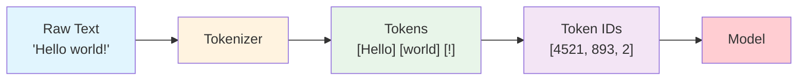

**Why does tokenization matter?**

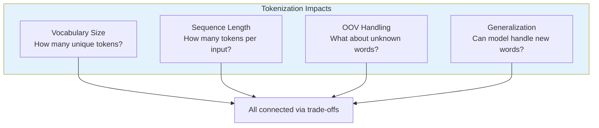

---

## The Tokenization Spectrum

[Back to Table of Contents](#table-of-contents)

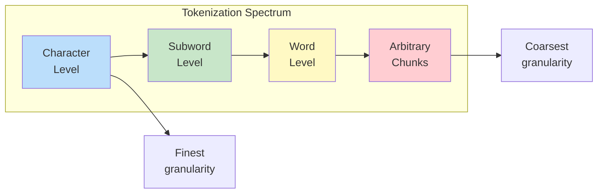

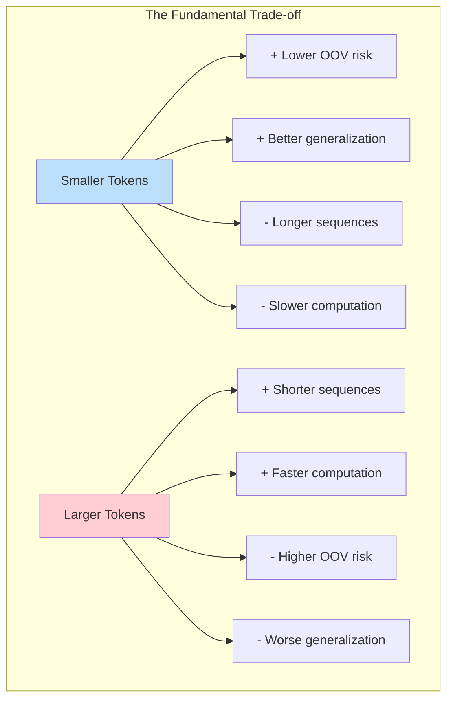

---

## Tokenization Methods

### 1. Character-Level Tokenization

[Back to Table of Contents](#table-of-contents)

**Concept:** Split text into individual characters (including spaces).

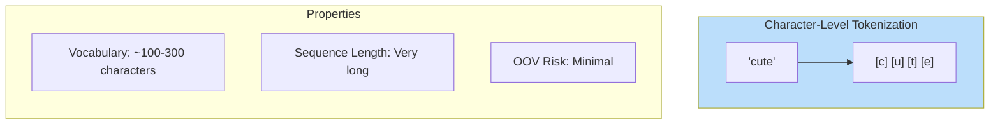

**Example with full sentence:**

```
Input:  "A cute teddy bear"
Tokens: [A] [ ] [c] [u] [t] [e] [ ] [t] [e] [d] [d] [y] [ ] [b] [e] [a] [r]
Count:  17 tokens
```

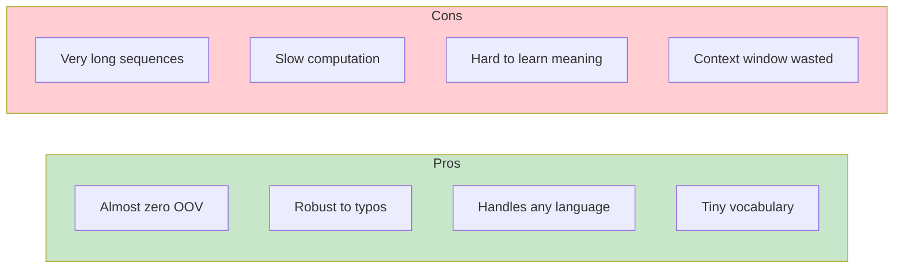

**Think:** Raw symbols - maximum flexibility, minimum efficiency

---

### 2. Word-Level Tokenization

[Back to Table of Contents](#table-of-contents)

**Concept:** Split text on whitespace and punctuation.

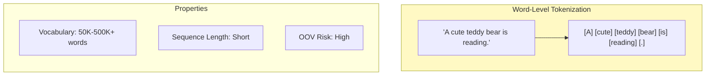

**Example:**

```
Input:  "A cute teddy bear is reading."
Tokens: [A] [cute] [teddy] [bear] [is] [reading] [.]
Count:  7 tokens
```

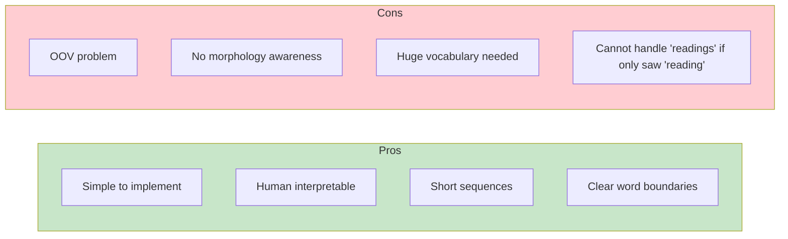

**The OOV Problem Illustrated:**

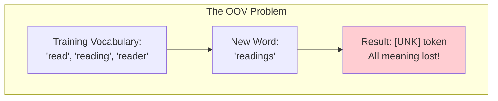

**Think:** Split on spaces, done - simple but fragile

---

### 3. Subword-Level Tokenization (BPE / WordPiece)

[Back to Table of Contents](#table-of-contents)

**Concept:** Learn frequently occurring subword units from data.

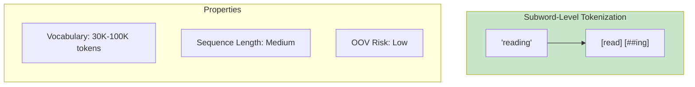

**Example:**

```
Input:  "A cute teddy bear is reading."
Tokens: [A] [cute] [ted] [##dy] [bear] [is] [read] [##ing] [.]
   or:  [A] [cute] [teddy] [bear] [is] [read] [##ing] [.]
Count:  ~8-9 tokens
```

The `##` prefix indicates a continuation token (used by WordPiece).

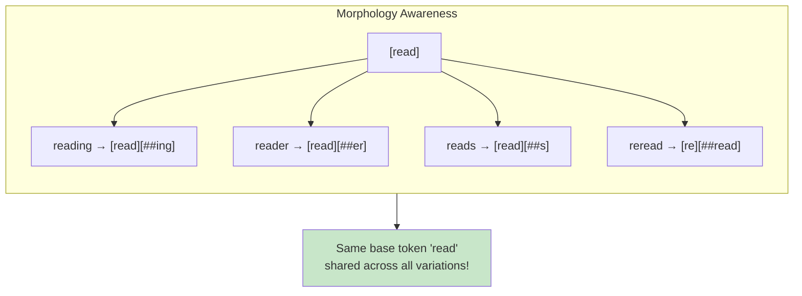

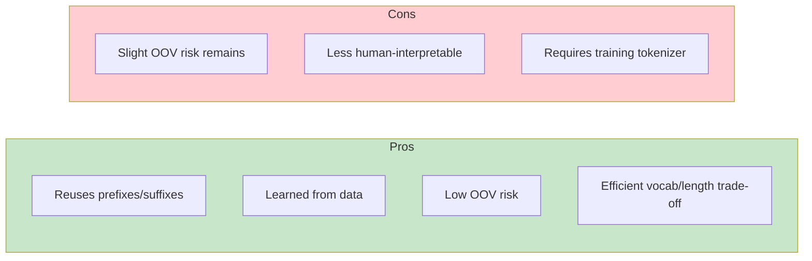

**This is what modern LLMs use!**

**Think:** Learned reusable components - the sweet spot

---

### 4. Arbitrary Tokenization

[Back to Table of Contents](#table-of-contents)

**Concept:** Tokens can be any frequently occurring chunk (learned purely from statistics).

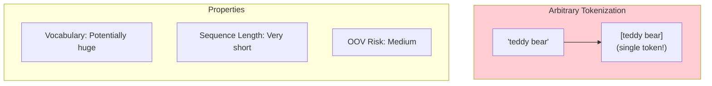

**Example:**

```
Input:  "A cute teddy bear is reading."
Tokens: [A] [cute] [teddy bear] [is] [reading] [.]
Count:  6 tokens (phrase "teddy bear" merged!)
```

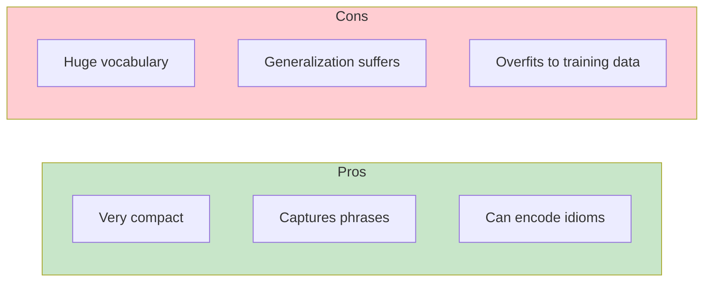

**Think:** Data-driven chunking without linguistic rules

---

## Visual Example: "A cute teddy bear is reading."

[Back to Table of Contents](#table-of-contents)

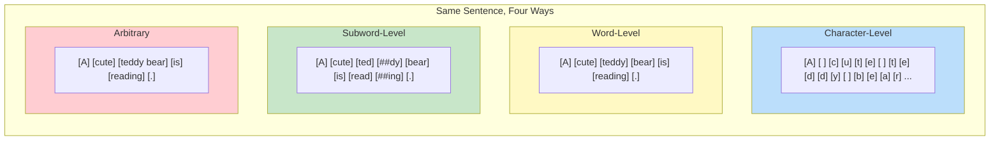

**Token counts comparison:**

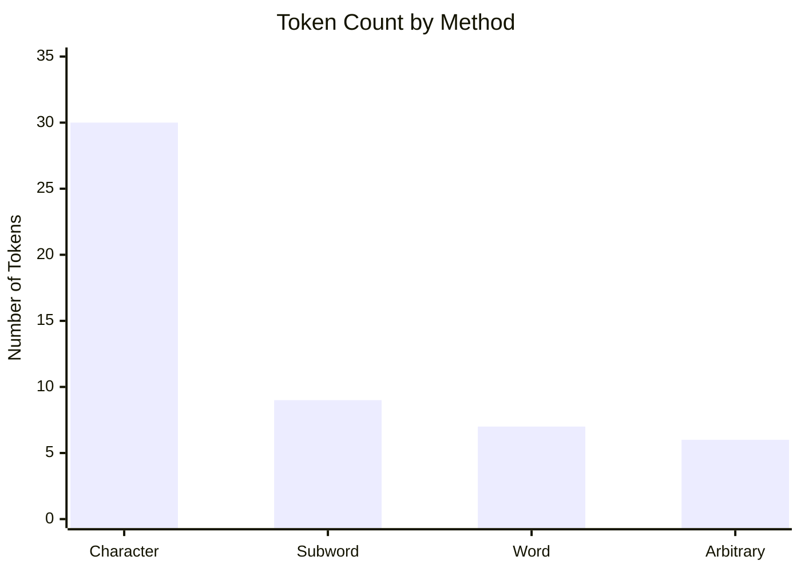

---

## Comparison Table

[Back to Table of Contents](#table-of-contents)

| Method | Vocabulary Size | Sequence Length | OOV Risk | Generalization |
|--------|----------------|-----------------|----------|----------------|
| **Character** | Very small (~100) | Very long | Minimal | High |
| **Subword** | Medium (~30K-100K) | Medium | Low | High |
| **Word** | Large (~100K+) | Short | High | Low |
| **Arbitrary** | Potentially huge | Very short | Medium | Depends |

```mermaid
quadrantChart
    title Tokenization Method Trade-offs
    x-axis Low Vocabulary Size --> High Vocabulary Size
    y-axis Long Sequences --> Short Sequences
    quadrant-1 Arbitrary: compact but huge vocab
    quadrant-2 Word: simple but OOV issues
    quadrant-3 Character: robust but slow
    quadrant-4 Subword: balanced sweet spot
    Character: [0.15, 0.1]
    Subword: [0.45, 0.5]
    Word: [0.75, 0.8]
    Arbitrary: [0.9, 0.9]
```

---

## Trade-offs Visualization

[Back to Table of Contents](#table-of-contents)

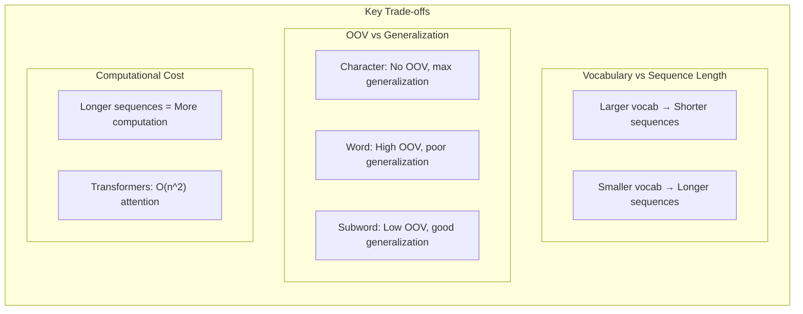

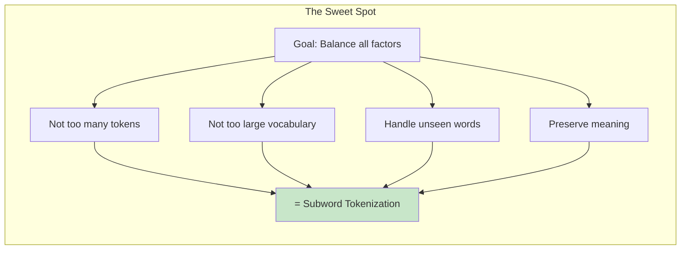

---

## Why Subword Tokenization Wins

[Back to Table of Contents](#table-of-contents)

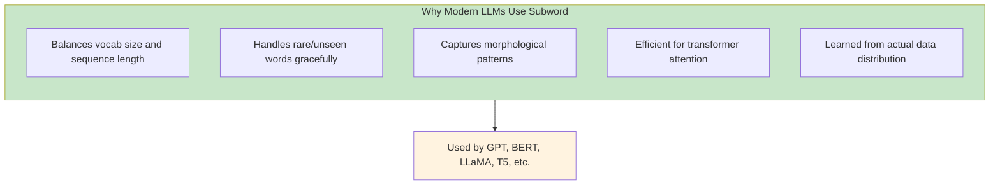

**Real-world examples:**

| Model | Tokenizer | Vocab Size |
|-------|-----------|------------|
| GPT-2/3/4 | BPE | ~50K |
| BERT | WordPiece | ~30K |
| T5 | SentencePiece | ~32K |
| LLaMA | SentencePiece (BPE) | ~32K |

---

## Key Algorithms

[Back to Table of Contents](#table-of-contents)

### Byte Pair Encoding (BPE)

```mermaid
flowchart TB
    subgraph bpe["BPE Algorithm"]
        direction TB
        
        S1["1. Start with character vocabulary"]
        S2["2. Count all adjacent pairs"]
        S3["3. Merge most frequent pair"]
        S4["4. Add merged token to vocab"]
        S5["5. Repeat until vocab size reached"]
        
        S1 --> S2 --> S3 --> S4 --> S5
        S5 --> |"Repeat"| S2
    end
    
    style bpe fill:#e3f2fd
```

**BPE Example:**

```mermaid
flowchart TB
    subgraph bpe_ex["BPE Merge Example"]
        direction TB
        
        INIT["Initial: [l] [o] [w] [e] [r]"]
        M1["Merge 'l'+'o' → [lo] [w] [e] [r]"]
        M2["Merge 'lo'+'w' → [low] [e] [r]"]
        M3["Merge 'e'+'r' → [low] [er]"]
        M4["Merge 'low'+'er' → [lower]"]
        
        INIT --> M1 --> M2 --> M3 --> M4
    end
```

### WordPiece

```mermaid
flowchart TB
    subgraph wordpiece["WordPiece (BERT)"]
        direction TB
        
        WP1["Similar to BPE but..."]
        WP2["Uses likelihood-based merging"]
        WP3["Prefixes continuation tokens with ##"]
        
        EX["'unhappiness' → [un] [##happi] [##ness]"]
    end
    
    style wordpiece fill:#fff3e0
```

### SentencePiece

```mermaid
flowchart TB
    subgraph sentencepiece["SentencePiece (Google)"]
        direction TB
        
        SP1["Language-agnostic"]
        SP2["Treats text as raw bytes"]
        SP3["No pre-tokenization needed"]
        SP4["Used by T5, LLaMA, etc."]
    end
    
    style sentencepiece fill:#f3e5f5
```

---

## The OOV Problem

[Back to Table of Contents](#table-of-contents)

```mermaid
flowchart TB
    subgraph oov["Out-of-Vocabulary (OOV) Problem"]
        direction TB
        
        subgraph word_oov["Word-Level: OOV Disaster"]
            WO1["Training: 'happy', 'happiness'"]
            WO2["Test: 'happily'"]
            WO3["Result: [UNK]"]
            
            WO1 --> WO2 --> WO3
        end
        
        subgraph sub_oov["Subword-Level: OOV Handled"]
            SO1["Training: [happi], [ness], [ly]"]
            SO2["Test: 'happily'"]
            SO3["Result: [happi] [ly]"]
            
            SO1 --> SO2 --> SO3
        end
    end
    
    style word_oov fill:#ffcdd2
    style sub_oov fill:#c8e6c9
```

**OOV scenarios and solutions:**

```mermaid
flowchart LR
    subgraph scenarios["Common OOV Scenarios"]
        S1["New words: 'COVID'"]
        S2["Typos: 'teh' for 'the'"]
        S3["Names: 'Schwarzenegger'"]
        S4["Technical terms: 'transformers'"]
        S5["Morphological variants: 'unhappiest'"]
    end
    
    subgraph solutions["Subword Solutions"]
        SOL1["Break into known pieces"]
        SOL2["Character fallback"]
        SOL3["Compose from parts"]
    end
    
    scenarios --> solutions
    
    style solutions fill:#c8e6c9
```

---

## Summary: The Big Picture

[Back to Table of Contents](#table-of-contents)

```mermaid
flowchart TB
    subgraph big_picture["Tokenization: The Big Picture"]
        direction TB
        
        subgraph spectrum2["The Spectrum"]
            direction LR
            FINE["Fine-grained<br/>(Character)"] --> MED["Medium<br/>(Subword)"] --> COARSE["Coarse-grained<br/>(Word/Arbitrary)"]
        end
        
        subgraph winner["The Winner"]
            W["Subword Tokenization<br/>(BPE, WordPiece, SentencePiece)"]
        end
        
        subgraph why["Why?"]
            Y1["Balanced trade-offs"]
            Y2["Low OOV risk"]
            Y3["Good generalization"]
            Y4["Efficient computation"]
        end
        
        spectrum2 --> winner
        winner --> why
    end
    
    style winner fill:#c8e6c9
```

```mermaid
flowchart LR
    subgraph pipeline["Tokenization in the LLM Pipeline"]
        direction LR
        TEXT["Raw Text"] --> TOK["Tokenizer<br/>(BPE/WordPiece)"]
        TOK --> IDS["Token IDs"]
        IDS --> EMB["Embeddings"]
        EMB --> MODEL["Transformer"]
        MODEL --> OUT["Output"]
    end
    
    style TOK fill:#fff3e0
```

---

## Quick Reference Card

[Back to Table of Contents](#table-of-contents)

```mermaid
flowchart TB
    subgraph methods_ref["Methods"]
        MR1["Character = Every symbol"]
        MR2["Word = Split on spaces"]
        MR3["Subword = Learned chunks"]
        MR4["Arbitrary = Frequency-based"]
    end
    
    subgraph algorithms_ref["Algorithms"]
        AR1["BPE = GPT family"]
        AR2["WordPiece = BERT"]
        AR3["SentencePiece = T5, LLaMA"]
    end
    
    subgraph rules_ref["Rules of Thumb"]
        RR1["Smaller tokens = Lower OOV"]
        RR2["Larger tokens = Shorter sequences"]
        RR3["Subword = Best balance"]
    end
    
    subgraph modern_ref["Modern LLMs"]
        MOD["All use subword tokenization<br/>~30K-100K vocabulary"]
    end
    
    style modern_ref fill:#c8e6c9
```

**Key Takeaway:**

> Subword tokenization (BPE/WordPiece) is the standard for modern LLMs because it achieves the optimal balance between vocabulary size, sequence length, and OOV handling.
