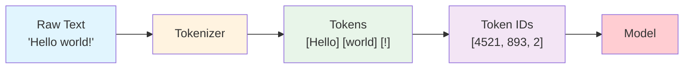
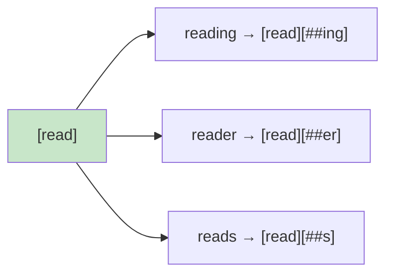
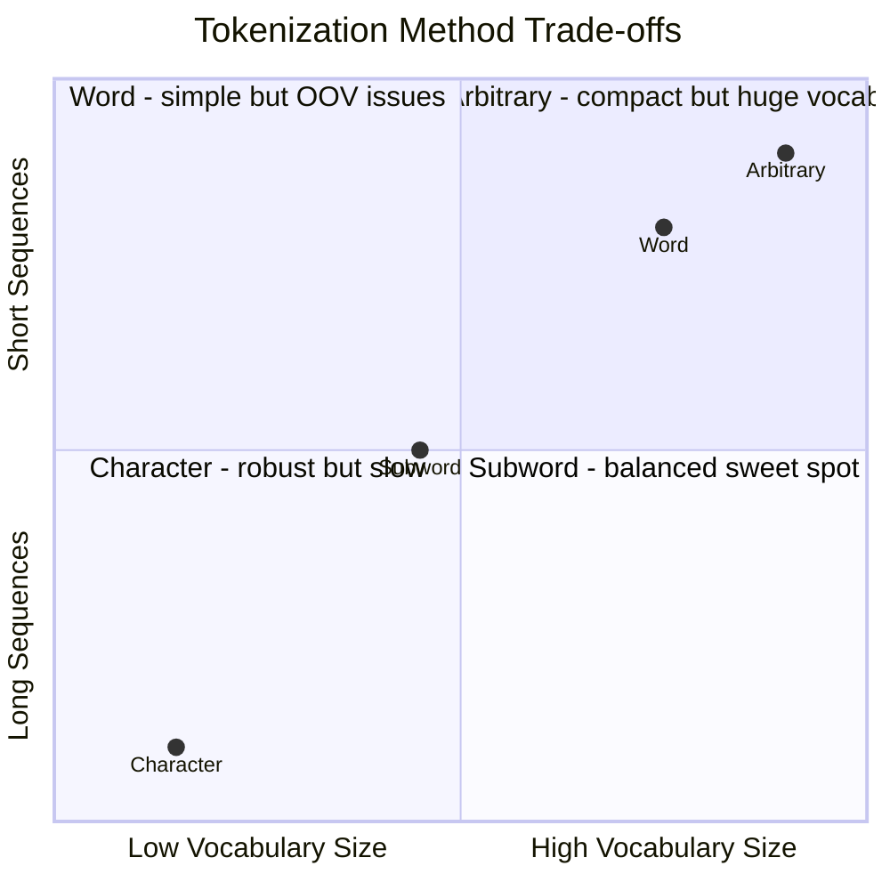

# Session 2: Tokenization

**Course:** Stanford LLM (ICME)

---

## Table of Contents

- [Overview: What is Tokenization?](#overview-what-is-tokenization)
- [The Tokenization Spectrum](#the-tokenization-spectrum)
- [Tokenization Methods](#tokenization-methods)
  - [1. Character-Level Tokenization](#1-character-level-tokenization)
  - [2. Word-Level Tokenization](#2-word-level-tokenization)
  - [3. Subword-Level Tokenization (BPE / WordPiece)](#3-subword-level-tokenization-bpe--wordpiece)
  - [4. Arbitrary Tokenization](#4-arbitrary-tokenization)
- [Comparison Table](#comparison-table)
- [Key Algorithms](#key-algorithms)
- [Quick Reference Card](#quick-reference-card)

---

## Overview: What is Tokenization?

[Back to Table of Contents](#table-of-contents)

Tokenization is the process of breaking text into smaller units (tokens) that a model can process.



**Why does tokenization matter?**

- **Vocabulary Size:** How many unique tokens does the model know?
- **Sequence Length:** How many tokens per input? (Affects computation cost)
- **OOV Handling:** What happens with unknown words?
- **Generalization:** Can the model handle new/rare words?

> **OOV (Out-of-Vocabulary):** When a model encounters a word it has never seen during training, it cannot process it. For example, if a model was trained on "happy" and "happiness" but never saw "happily", it treats "happily" as unknown and replaces it with a special `[UNK]` token, losing all meaning.

---

## The Tokenization Spectrum

[Back to Table of Contents](#table-of-contents)

From finest to coarsest granularity:

```
Fine-grained                                              Coarse-grained
     |                                                           |
     v                                                           v
+-----------+     +-----------+     +-----------+     +-----------+
| Character |     |  Subword  |     |   Word    |     | Arbitrary |
+-----------+     +-----------+     +-----------+     +-----------+
   [c][a][t]       [read][##ing]    [reading]         [teddy bear]
                                                         
  tiny vocab       medium vocab     large vocab        huge vocab
  long sequences   medium length    short sequences    very short
  no OOV           low OOV          high OOV           medium OOV
```

**The Fundamental Trade-off:**

| Smaller Tokens | Larger Tokens |
|----------------|---------------|
| + Lower OOV risk | + Shorter sequences |
| + Better generalization | + Faster computation |
| - Longer sequences | - Higher OOV risk |
| - Slower computation | - Worse generalization |

---

## Tokenization Methods

### 1. Character-Level Tokenization

[Back to Table of Contents](#table-of-contents)

**Concept:** Split text into individual characters (including spaces).

```
Input:  "A cute teddy bear"
Tokens: [A] [ ] [c] [u] [t] [e] [ ] [t] [e] [d] [d] [y] [ ] [b] [e] [a] [r]
Count:  17 tokens
```

**Properties:**
- Vocabulary: ~100-300 characters
- Sequence Length: Very long
- OOV Risk: Minimal

**Pros:** Almost zero OOV, robust to typos, handles any language, tiny vocabulary

**Cons:** Very long sequences, slow computation, hard to learn word meaning

**Think:** Raw symbols - maximum flexibility, minimum efficiency

---

### 2. Word-Level Tokenization

[Back to Table of Contents](#table-of-contents)

**Concept:** Split text on whitespace and punctuation.

```
Input:  "A cute teddy bear is reading."
Tokens: [A] [cute] [teddy] [bear] [is] [reading] [.]
Count:  7 tokens
```

**Properties:**
- Vocabulary: 50K-500K+ words
- Sequence Length: Short
- OOV Risk: High

**Pros:** Simple to implement, human interpretable, short sequences

**Cons:** OOV problem, no morphology awareness, huge vocabulary needed

**The OOV Problem:**
```
Training vocabulary: 'read', 'reading', 'reader'
New word at test:   'readings'
Result:             [UNK] → All meaning lost!
```

**Think:** Split on spaces, done - simple but fragile

---

### 3. Subword-Level Tokenization (BPE / WordPiece)

[Back to Table of Contents](#table-of-contents)

**Concept:** Learn frequently occurring subword units from data.

```
Input:  "A cute teddy bear is reading."
Tokens: [A] [cute] [ted] [##dy] [bear] [is] [read] [##ing] [.]
Count:  ~8-9 tokens
```

The `##` prefix indicates a continuation token (used by WordPiece).

**Properties:**
- Vocabulary: 30K-100K tokens
- Sequence Length: Medium
- OOV Risk: Low

**Morphology Awareness:**



Same base token shared across all variations!

**Pros:** Reuses prefixes/suffixes, learned from data, low OOV risk, efficient trade-off

**Cons:** Slight OOV risk remains, less human-interpretable, requires training tokenizer

**This is what modern LLMs use!**

**Think:** Learned reusable components - the sweet spot

---

### 4. Arbitrary Tokenization

[Back to Table of Contents](#table-of-contents)

**Concept:** Tokens can be any frequently occurring chunk (learned purely from statistics).

```
Input:  "A cute teddy bear is reading."
Tokens: [A] [cute] [teddy bear] [is] [reading] [.]
Count:  6 tokens (phrase "teddy bear" merged!)
```

**Properties:**
- Vocabulary: Potentially huge
- Sequence Length: Very short
- OOV Risk: Medium

**Pros:** Very compact, captures phrases, can encode idioms

**Cons:** Huge vocabulary, generalization suffers, overfits to training data

**Think:** Data-driven chunking without linguistic rules

---

## Comparison Table

[Back to Table of Contents](#table-of-contents)

| Method | Vocabulary Size | Sequence Length | OOV Risk | Generalization |
|--------|----------------|-----------------|----------|----------------|
| **Character** | Very small (~100) | Very long | Minimal | High |
| **Subword** | Medium (~30K-100K) | Medium | Low | High |
| **Word** | Large (~100K+) | Short | High | Low |
| **Arbitrary** | Potentially huge | Very short | Medium | Depends |



---

## Key Algorithms

[Back to Table of Contents](#table-of-contents)

### Byte Pair Encoding (BPE)

Used by: GPT-2/3/4

**Algorithm:**
1. Start with character vocabulary
2. Count all adjacent pairs
3. Merge most frequent pair
4. Add merged token to vocab
5. Repeat until vocab size reached

**Example:**
```
Initial:           [l] [o] [w] [e] [r]
Merge 'l'+'o':     [lo] [w] [e] [r]
Merge 'lo'+'w':    [low] [e] [r]
Merge 'e'+'r':     [low] [er]
Merge 'low'+'er':  [lower]
```

### WordPiece

Used by: BERT (~30K vocab)

- Similar to BPE but uses likelihood-based merging
- Prefixes continuation tokens with `##`
- Example: `'unhappiness' → [un] [##happi] [##ness]`

### SentencePiece

Used by: T5, LLaMA (~32K vocab)

- Language-agnostic
- Treats text as raw bytes
- No pre-tokenization needed

---

## Quick Reference Card

[Back to Table of Contents](#table-of-contents)

**Methods:**
- Character = Every symbol
- Word = Split on spaces  
- Subword = Learned chunks
- Arbitrary = Frequency-based phrases

**Algorithms → Models:**
- BPE → GPT family (~50K vocab)
- WordPiece → BERT (~30K vocab)
- SentencePiece → T5, LLaMA (~32K vocab)

**Rules of Thumb:**
- Smaller tokens = Lower OOV, longer sequences
- Larger tokens = Shorter sequences, higher OOV
- Subword = Best balance

**Key Takeaway:**

> Subword tokenization (BPE/WordPiece) is the standard for modern LLMs because it achieves the optimal balance between vocabulary size, sequence length, and OOV handling.
