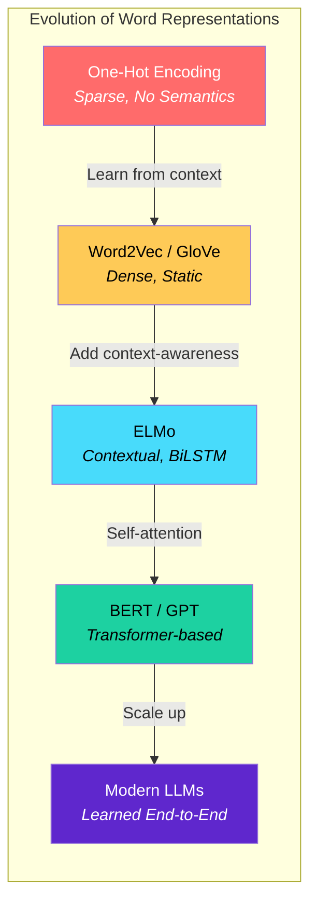
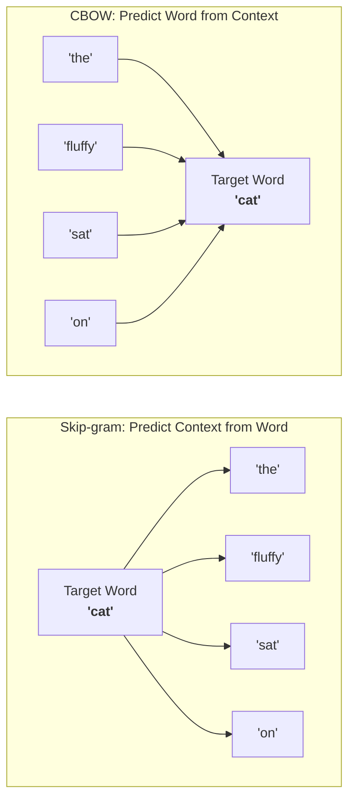
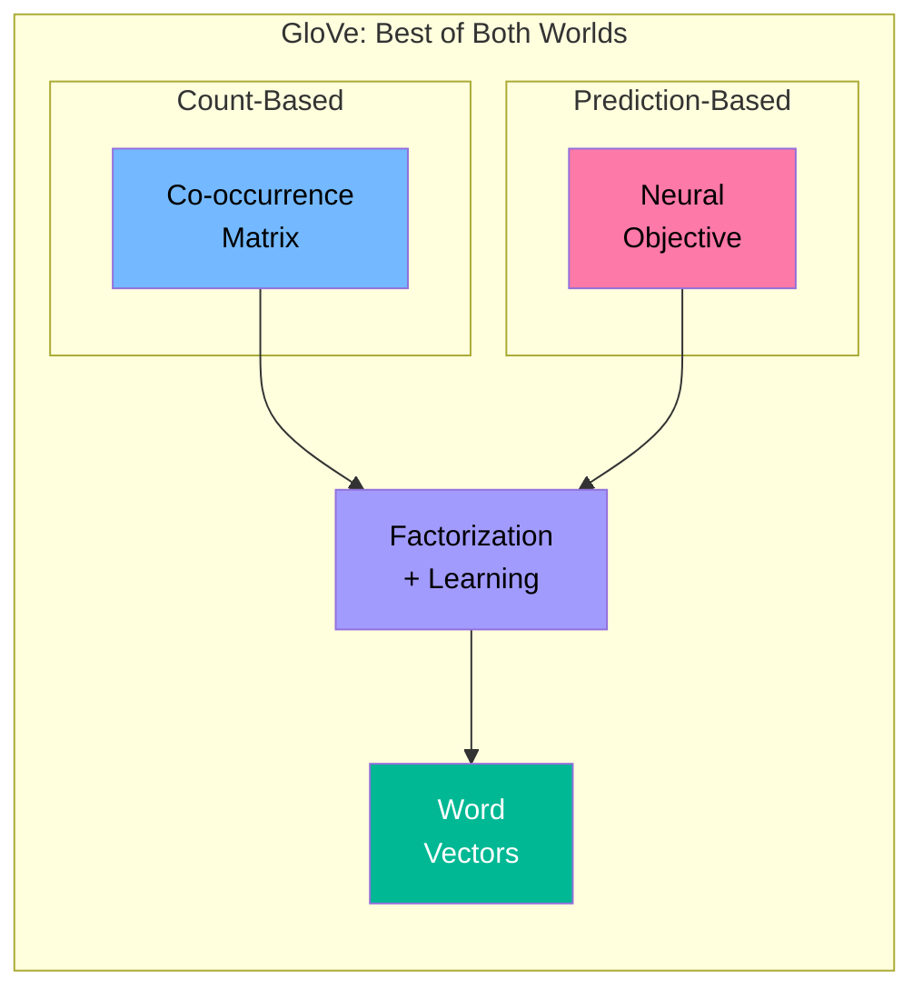
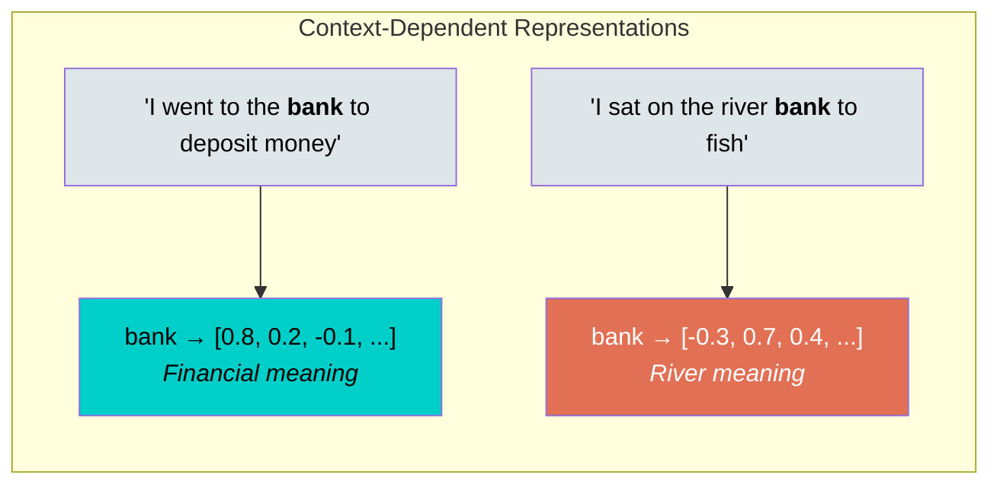
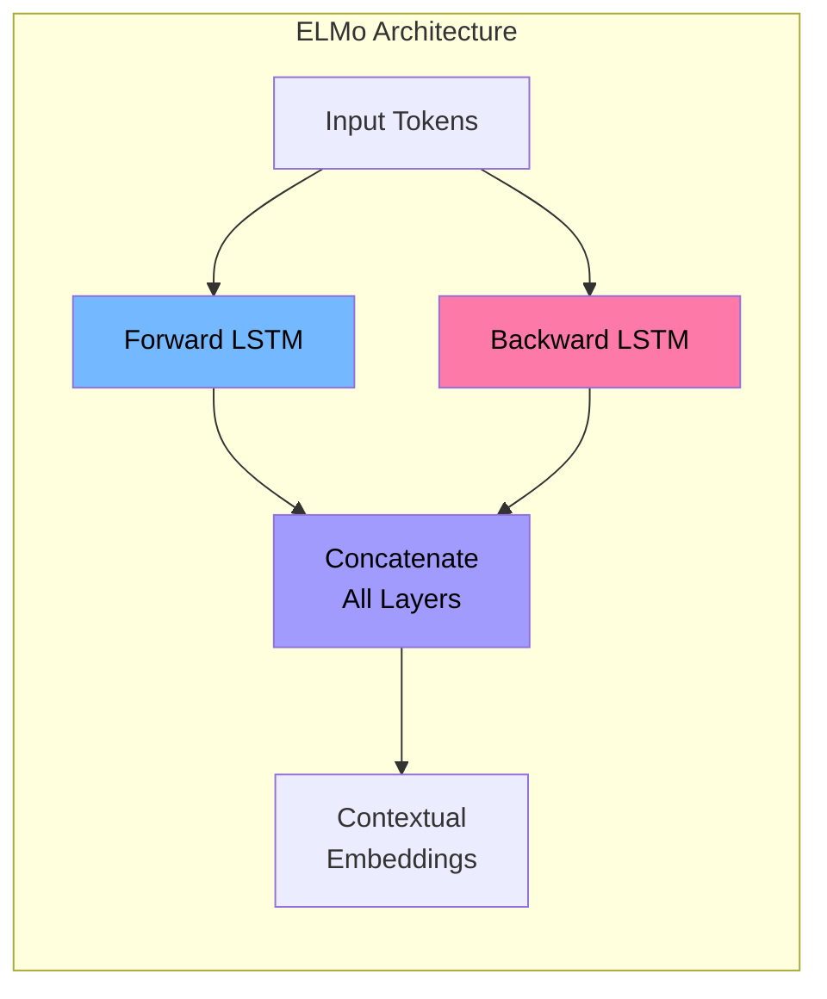
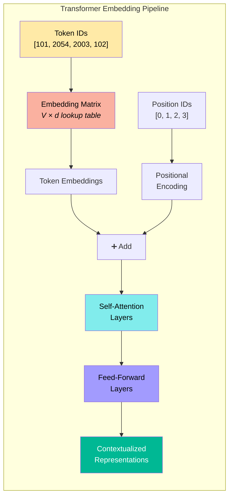
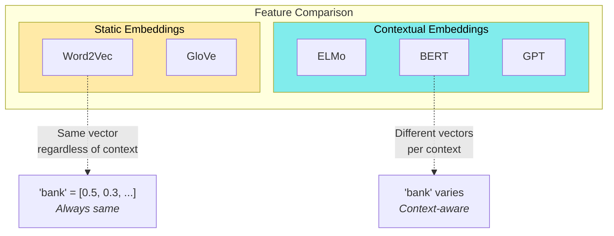

# Session 3: Word Representations

**Course:** Stanford LLM (ICME)

---

## Table of Contents

- [Overview: From Tokens to Vectors](#overview-from-tokens-to-vectors)
- [Naive One-Hot Encoding](#naive-one-hot-encoding)
  - [How It Works](#how-it-works)
  - [The Vector Space Problem](#the-vector-space-problem)
  - [Why One-Hot Fails](#why-one-hot-fails)
- [Word Embeddings](#word-embeddings)
- [Learned Representations](#learned-representations)
- [Quick Reference Card](#quick-reference-card)

---

## Overview: From Tokens to Vectors

[Back to Table of Contents](#table-of-contents)

After tokenization, we have token IDs. But the model needs **vector representations** to do math.

```
Raw text → Tokenizer → Token IDs → Word Representation → Embeddings → Model
                                          ↑
                                    (This section)
```

The challenge: How do we convert discrete token IDs into continuous vectors that capture meaning?

---

## Naive One-Hot Encoding

[Back to Table of Contents](#table-of-contents)

### How It Works

One-hot encoding is the simplest representation: each word gets a vector with exactly one 1 and all other 0s.

**Example with 3 words:**

```
Vocabulary: {soft, book, teddy bear}

soft        = [1, 0, 0]
book        = [0, 1, 0]
teddy bear  = [0, 0, 1]
```

**Properties:**
- Vector length = vocabulary size
- Only one position is "hot" (1), rest are 0
- Vectors are orthogonal (perpendicular)
- All words equally distant from each other

### The Vector Space Problem

One-hot vectors lie on the axes of a high-dimensional space, completely independent of each other.

**3D coordinate system with one-hot vectors:**

```
                    teddy bear
                          |
                          |
                        (0,0,1) *
                         /|
                        / |
                       /  |
                      /   |
                     /    |
        (0,1,0) ────*─────┼──→ soft (1,0,0)
         /     book |     /
        /           |    /
       /            |   /
      /             |  /
     /              | /
    /               |/
   /________________/

One-hot vectors sit on the axes - they're perpendicular to each other!
```

**Why orthogonal = zero similarity:**

Each word is represented on its own axis, so the dot product is always 0:

```
soft · book       = [1,0,0] · [0,1,0] = 0
soft · teddy bear = [1,0,0] · [0,0,1] = 0
book · teddy bear = [0,1,0] · [0,0,1] = 0

Cosine similarity = dot product / (length1 × length2) = 0 / (1 × 1) = 0
```

**Result:** All word pairs have similarity = 0. Even semantically related words (teddy bear + soft) look completely unrelated!

### Why One-Hot Fails

**Problem 1: Orthogonality loses meaning**
```
"teddy bear" and "soft" are related (soft teddy bear)
"teddy bear" and "book" are related (teddy bear in a book)
One-hot says: Both have similarity 0. Completely wrong!
```

**Problem 2: Massive memory waste**
```
Vocabulary size: 50K words
Vector length: 50K dimensions
Sparsity: 99.998% zeros (only 1 non-zero per vector)
Memory: Wasteful!
```

**Problem 3: No generalization**
```
Training on "happy" doesn't help with "happiness"
Each word is treated as completely independent
```

**Problem 4: Curse of dimensionality**
```
With 100K vocabulary → 100K dimensional space
Hard to compute, slow to train, poor generalization
```

---

## Word Embeddings

[Back to Table of Contents](#table-of-contents)

To fix one-hot encoding, we use **dense, low-dimensional embeddings**.

**The key idea:**

```
One-hot:  sparse, high-dimensional, orthogonal
          [0,0,0,1,0,0,0,0,0,0,0,0,...] (50K dimensions, 1 non-zero)

Embedding: dense, low-dimensional, semantic
           [0.2, -0.5, 0.8, 0.1, -0.3] (300 dimensions, all non-zero)
```

**In embedding space:**
- "soft" and "teddy bear" are **close together** (high similarity)
- "dog" and "cat" are **close together** (both animals)
- "king" and "queen" are **close together** (both royalty)
- "dog" and "car" are **far apart** (different concepts)

**Example with 2D embeddings:**

In embedding space, semantically similar words cluster together:

```
                 Positive/Happy Axis
                          |
                          |
                    happy * (0.8, 0.2)
                   /     cheerful * (0.7, 0.1)
                  /            glad * (0.75, 0.15)
                 /              |
                /               |
               /                |
              /            Related words
             /             cluster TOGETHER
            /
───────────┼─────────────────→ Royalty Axis
          /|
         / |
        /  |
    king * |  (0.1, 0.8)
   /   queen * (0.15, 0.75)
  /       prince * (0.2, 0.85)
 /
/    dog * (0.3, 0.4)
         car * (0.5, 0.3)
         
Key: Similar words have similar coordinates (close in space)
     Different words are far apart
```

**Contrast with one-hot:**
- One-hot: all words at 90° angles (completely independent)
- Embeddings: similar words at small angles (semantically related)

---

## Learned Representations

[Back to Table of Contents](#table-of-contents)

Modern approaches learn embeddings from data. Here's how these methods evolved:



### Word2Vec (Skip-gram / CBOW)

Two architectures for learning word vectors from context:



- Learn dense 300-dimensional vectors
- Fast and efficient training
- Captures semantic relationships (king - man + woman ≈ queen)

### GloVe (Global Vectors)



- Combine count-based and prediction-based methods
- Capture global word co-occurrence statistics
- Often outperforms Word2Vec on analogy tasks

### Contextual Embeddings (ELMo, BERT)

The same word gets **different embeddings** based on context:





- Much more powerful than fixed embeddings
- Pre-trained on large corpora, fine-tuned for tasks

### Transformer Embeddings



All modern LLMs use this approach:
- Token → Embedding matrix → Dense vector
- Add positional information
- Transform through attention layers
- Trained end-to-end with the model

### Comparison of Approaches



| Feature | Word2Vec/GloVe | ELMo | BERT/GPT |
|---------|----------------|------|----------|
| Context-aware | ❌ | ✓ | ✓ |
| Bidirectional | N/A | ✓ | ✓ (BERT) |
| Pre-training | Word-level | Sentence | Document |
| Parameters | ~1M | ~100M | ~100M-175B |

---

## Quick Reference Card

[Back to Table of Contents](#table-of-contents)

**One-Hot Encoding:**
- ❌ All words equally similar
- ❌ Wastes memory (sparse, high-dimensional)
- ❌ No semantic information
- ✓ Interpretable: know exactly which word

**Dense Embeddings:**
- ✓ Similar words are close together
- ✓ Memory efficient (dense, low-dimensional)
- ✓ Captures semantic relationships
- ✓ Generalization across similar words
- ❌ Not directly interpretable

**Key Insight:**

> Good word representations put **semantically similar words close together** in continuous vector space. This is the foundation of modern NLP.

**Representation Progression:**

```
One-Hot (naive)
    ↓
Word Embeddings (Word2Vec, GloVe)
    ↓
Contextual Embeddings (ELMo, BERT)
    ↓
Transformer Embeddings (GPT, LLaMA)
```
