# Session 3: Word Representations

**Course:** Stanford LLM (ICME)

---

## Table of Contents

- [Overview: From Tokens to Vectors](#overview-from-tokens-to-vectors)
- [Naive One-Hot Encoding](#naive-one-hot-encoding)
  - [How It Works](#how-it-works)
  - [The Vector Space Problem](#the-vector-space-problem)
  - [Why One-Hot Fails](#why-one-hot-fails)
- [Word Embeddings](#word-embeddings)
- [Learned Representations](#learned-representations)
- [Quick Reference Card](#quick-reference-card)

---

## Overview: From Tokens to Vectors

[Back to Table of Contents](#table-of-contents)

After tokenization, we have token IDs. But the model needs **vector representations** to do math.

```
Raw text → Tokenizer → Token IDs → Word Representation → Embeddings → Model
                                          ↑
                                    (This section)
```

The challenge: How do we convert discrete token IDs into continuous vectors that capture meaning?

---

## Naive One-Hot Encoding

[Back to Table of Contents](#table-of-contents)

### How It Works

One-hot encoding is the simplest representation: each word gets a vector with exactly one 1 and all other 0s.

**Example with 3 words:**

```
Vocabulary: {soft, book, teddy bear}

soft        = [1, 0, 0]
book        = [0, 1, 0]
teddy bear  = [0, 0, 1]
```

**Properties:**
- Vector length = vocabulary size
- Only one position is "hot" (1), rest are 0
- Vectors are orthogonal (perpendicular)
- All words equally distant from each other

### The Vector Space Problem

One-hot vectors lie on the axes of a high-dimensional space, completely independent of each other.

```mermaid
flowchart LR
    subgraph onehot["One-Hot Vector Space"]
        direction TB
        
        subgraph vecs["Vectors"]
            V1["soft = [1, 0, 0]"]
            V2["book = [0, 1, 0]"]
            V3["teddy bear = [0, 0, 1]"]
        end
        
        subgraph props["Properties"]
            P1["✓ Sparse (mostly zeros)"]
            P2["✗ Orthogonal (perpendicular)"]
            P3["✗ No similarity captured"]
        end
        
        vecs --> props
    end
    
    style V1 fill:#bbdefb
    style V2 fill:#fff9c4
    style V3 fill:#ffcdd2
    style props fill:#e3f2fd
```



**Similarity between any two words:**

```
Cosine Similarity = Dot Product of normalized vectors

soft · book       = [1,0,0] · [0,1,0] = 1*0 + 0*1 + 0*0 = 0
soft · teddy bear = [1,0,0] · [0,0,1] = 1*0 + 0*0 + 0*1 = 0
book · teddy bear = [0,1,0] · [0,0,1] = 0*0 + 1*0 + 0*1 = 0
```

**Result:** All word pairs have similarity = 0. Even semantically related words (teddy bear + soft) look completely unrelated!

### Why One-Hot Fails

**Problem 1: Orthogonality loses meaning**
```
"teddy bear" and "soft" are related (soft teddy bear)
"teddy bear" and "book" are related (teddy bear in a book)
One-hot says: Both have similarity 0. Completely wrong!
```

**Problem 2: Massive memory waste**
```
Vocabulary size: 50K words
Vector length: 50K dimensions
Sparsity: 99.998% zeros (only 1 non-zero per vector)
Memory: Wasteful!
```

**Problem 3: No generalization**
```
Training on "happy" doesn't help with "happiness"
Each word is treated as completely independent
```

**Problem 4: Curse of dimensionality**
```
With 100K vocabulary → 100K dimensional space
Hard to compute, slow to train, poor generalization
```

---

## Word Embeddings

[Back to Table of Contents](#table-of-contents)

To fix one-hot encoding, we use **dense, low-dimensional embeddings**.

**The key idea:**

```
One-hot:  sparse, high-dimensional, orthogonal
          [0,0,0,1,0,0,0,0,0,0,0,0,...] (50K dimensions, 1 non-zero)

Embedding: dense, low-dimensional, semantic
           [0.2, -0.5, 0.8, 0.1, -0.3] (300 dimensions, all non-zero)
```

**In embedding space:**
- "soft" and "teddy bear" are **close together** (high similarity)
- "dog" and "cat" are **close together** (both animals)
- "king" and "queen" are **close together** (both royalty)
- "dog" and "car" are **far apart** (different concepts)

**Example with 2D embeddings:**

In embedding space, semantically similar words cluster together:

```mermaid
flowchart TB
    subgraph embed["Dense Embedding Space (2D example)"]
        direction TB
        
        subgraph sentiment["Sentiment Axis"]
            HAP["😊 happy<br/>0.8, 0.2"]
            CHEER["😊 cheerful<br/>0.7, 0.1"]
            GLAD["😊 glad<br/>0.75, 0.15"]
        end
        
        subgraph rank["Royalty Axis"]
            KING["👑 king<br/>0.1, 0.8"]
            QUEEN["👑 queen<br/>0.15, 0.75"]
            PRINCE["👑 prince<br/>0.2, 0.85"]
        end
        
        subgraph neutral["Neutral"]
            DOG["🐕 dog<br/>0.3, 0.4"]
            CAR["🚗 car<br/>0.5, 0.3"]
        end
        
        sentiment -->|"Similar<br/>vectors"| CHEER
        rank -->|"Similar<br/>vectors"| QUEEN
        neutral -->|"Different<br/>vectors"| CAR
    end
    
    style sentiment fill:#c8e6c9
    style rank fill:#bbdefb
    style neutral fill:#fff9c4
```



**Key insight:** Words with similar meanings have similar embeddings (close in vector space)

---

## Learned Representations

[Back to Table of Contents](#table-of-contents)

Modern approaches learn embeddings from data:

**Word2Vec (Skip-gram / CBOW)**
- Predict surrounding context words
- Learn dense 300-dimensional vectors
- Fast and efficient

**GloVe (Global Vectors)**
- Combine count-based and prediction-based methods
- Capture global word co-occurrence statistics

**Contextual Embeddings (ELMo, BERT)**
- Same word can have different embeddings based on context
- "bank" (financial) vs "bank" (river) get different representations
- Much more powerful than fixed embeddings

**Transformer Embeddings**
- All modern LLMs use learned embeddings
- Token → Embedding matrix → Dense vector
- Trained end-to-end with the model

---

## Quick Reference Card

[Back to Table of Contents](#table-of-contents)

**One-Hot Encoding:**
- ❌ All words equally similar
- ❌ Wastes memory (sparse, high-dimensional)
- ❌ No semantic information
- ✓ Interpretable: know exactly which word

**Dense Embeddings:**
- ✓ Similar words are close together
- ✓ Memory efficient (dense, low-dimensional)
- ✓ Captures semantic relationships
- ✓ Generalization across similar words
- ❌ Not directly interpretable

**Key Insight:**

> Good word representations put **semantically similar words close together** in continuous vector space. This is the foundation of modern NLP.

**Representation Progression:**

```
One-Hot (naive)
    ↓
Word Embeddings (Word2Vec, GloVe)
    ↓
Contextual Embeddings (ELMo, BERT)
    ↓
Transformer Embeddings (GPT, LLaMA)
```
