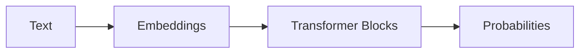
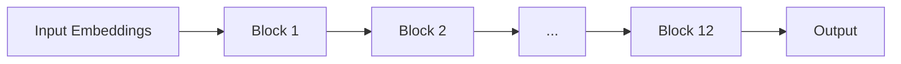

# Transformer Explainer -- 16 Sections

## Table of Contents

- [I. The Big Picture](#i-the-big-picture-what-is-happening) (Sections 1-3)
- [II. Turning Text into Numbers](#ii-turning-text-into-numbers-input-representation) (Sections 4-5)
- [III. The Core Engine](#iii-the-core-engine-transformer-blocks) (Sections 6-8)
- [IV. Stability & Regularization](#iv-stability--regularization-why-it-trains-properly) (Sections 9-10)
- [V. Producing the Next-Token Scores](#v-producing-the-next-token-scores-output-layer) (Sections 11-12)
- [VI. Sampling Strategy](#vi-sampling-strategy-decision-layer) (Sections 13-16)

---

## I. The Big Picture (What is happening?)

### 1. What is Transformer?

Transformer is the core architecture behind modern AI, powering models
like ChatGPT and Gemini. Introduced in 2017, it revolutionized how AI
processes information. The same architecture is used for training on
massive datasets and for inference to generate outputs. Here we use
GPT-2 (small), simpler than newer ones but perfect for learning the
fundamentals.

------------------------------------------------------------------------

### 2. How Transformers Work?

Transformers aren't magic---they build text step by step by asking:

**"What is the most probable next word that will follow this input?"**

**Example (from visualization):** Input text: `Mein Name ist Johannes` →
model predicts next token (e.g., `burg`).

------------------------------------------------------------------------

### 3. Transformer Architecture

Transformer has three main parts:

1.  **Embeddings** turn text into numbers.
2.  **Transformer blocks** mix information with Self-Attention and refine it
    with an MLP.
3.  **Probabilities** determine the likelihood of each next token.



------------------------------------------------------------------------

## II. Turning Text into Numbers (Input Representation)

> **🔍 Tracing "Name" through the pipeline:** To show how values flow from one step to the next, we'll trace the token "Name" using emoji markers:
> - 🔵 Token ID (6530) → used for embedding lookup
> - 🟢 Embedding values (0.15, 0.23, 0.85) → fed into positional encoding
> - 🟡 Final embedding after position added (0.17, 0.28) → input to attention
> - 🟠 Q/K values (1.23, 1.45) → used to compute attention scores
> - 🔴 Attention score (0.47) → determines how much "Johannes" attends to "Name"

### 4. Embedding

Before a Transformer can process text, it must convert it into numbers. This happens in two steps:

**Step 1: Tokenization** — The text is split into smaller units called **tokens**. These aren't always whole words; common subwords or characters get their own tokens.

**Step 2: Token → Vector** — Each token ID is used to look up a corresponding **embedding vector** from a learned embedding table.

**Example:** The sentence `Mein Name ist Johannes` becomes:

| Token | Token ID | Embedding (768 numbers) |
|-------|----------|-------------------------|
| `Me` | 5308 | [0.12, -0.45, 0.78, ..., -0.22] |
| `in` | 259 | [0.08, -0.41, 0.65, ..., -0.19] |
| `Name` | 🔵 6530 | [🟢 0.15, 🟢 0.23, -0.54, ..., 0.31] |
| `is` | 318 | [-0.05, 0.18, 0.42, ..., 0.09] |
| `t` | 83 | [0.22, -0.33, 0.11, ..., -0.45] |
| `Johannes` | 38579 | [0.07, -0.28, 0.89, ..., 0.14] |

Notice that "Mein" was split into `Me` + `in` and "ist" into `is` + `t`. The tokenizer breaks words into subwords based on what it learned during training.

**How does Token ID connect to the embedding vector?**

The Token ID is simply an **index into a lookup table**. GPT-2 has a vocabulary of 50,257 tokens. During training, it learns an **embedding table** — a matrix of size `50,257 × 768`. Each row is a unique vector for one token.

```
Embedding Table (learned during training):
┌─────────────────────────────────────────────┐
│ Row 0:     [0.02, -0.15, ..., 0.33]         │
│ Row 1:     [0.11,  0.08, ..., -0.21]        │
│ ...                                         │
│ Row 5308:  [0.12, -0.45, ..., -0.22]        │  ← "Me" looks up this row
│ ...                                         │
│ Row 6530:  [0.15,  0.23, ...,  0.31]        │  ← 🔵 "Name" looks up this row → 🟢
│ ...                                         │
│ Row 50256: [...]                            │
└─────────────────────────────────────────────┘
```

That's it — a simple table lookup. The magic is that these 768 numbers per token were **learned during training** to capture useful meaning.

**What might these 768 dimensions represent?**

Each dimension can encode some aspect of a token's meaning. While the model learns these automatically and they're not always human-interpretable, you can imagine dimensions capturing things like:

| Dimension | Possible meaning | "King" | "Queen" | "Apple" | "Name" | "Johannes" |
|-----------|------------------|--------|---------|---------|--------|------------|
| dim 1 | Royalty | 0.9 | 0.85 | -0.1 | -0.1 | -0.1 |
| dim 2 | Gender (masc→fem) | -0.7 | 0.8 | 0.0 | 0.0 | -0.5 |
| dim 3 | Edible | -0.2 | -0.2 | 0.95 | -0.3 | -0.3 |
| dim 4 | Abstract concept | 0.3 | 0.3 | -0.8 | 0.4 | -0.2 |
| dim 42 | Noun-ness | 0.8 | 0.8 | 0.9 | 🟢 0.85 | 0.7 |
| dim 100 | Verb-ness | -0.3 | -0.3 | -0.4 | -0.2 | -0.3 |
| dim 203 | Refers to person | 0.7 | 0.7 | -0.5 | 0.6 | 0.95 |
| ... | ... | ... | ... | ... | ... | ... |

Notice how "Name" and "Johannes" share similar values for "noun-ness" (both are nouns) and "refers to person" (both relate to identity), but differ in other dimensions. This similarity will become important in Section 7 when we see how attention connects related tokens.

This is why vector math works on embeddings: `King - Man + Woman ≈ Queen` — the dimensions encoding gender shift while royalty stays intact.

------------------------------------------------------------------------

### 5. Positional Encoding

Word order matters in language. Consider:
- "Johannes ist Name" — doesn't make sense
- "Name ist Johannes" — grammatically correct

Without position information, the model would see the same set of tokens and wouldn't know which comes first. **Positional encoding** solves this by giving each token information about its place in the sequence.

**How it works:** GPT-2 has a second lookup table — a **positional embedding table** of size `1024 × 768` (max 1024 positions). Each position gets its own 768-number vector, which is **added** to the token embedding.

**Example:** For `Mein Name ist Johannes`:

| Position | Token | Token ID | Token Embedding | + | Position Embedding | = | Final Embedding |
|----------|-------|----------|-----------------|---|-------------------|---|-----------------|
| 0 | `Me` | 5308 | [0.12, -0.45, ...] | + | [0.01, 0.02, ...] | = | [0.13, -0.43, ...] |
| 1 | `in` | 259 | [0.08, -0.41, ...] | + | [0.03, -0.01, ...] | = | [0.11, -0.42, ...] |
| 2 | `Name` | 🔵 6530 | [🟢 0.15, 🟢 0.23, ...] | + | [0.02, 0.05, ...] | = | [🟡 0.17, 🟡 0.28, ...] |
| 3 | `is` | 318 | [-0.05, 0.18, ...] | + | [-0.01, 0.03, ...] | = | [-0.06, 0.21, ...] |
| 4 | `t` | 83 | [0.22, -0.33, ...] | + | [0.04, -0.02, ...] | = | [0.26, -0.35, ...] |
| 5 | `Johannes` | 38579 | [0.07, -0.28, ...] | + | [0.02, 0.01, ...] | = | [0.09, -0.27, ...] |

Now each token's embedding contains both **what** the token is and **where** it appears.

**What might positional dimensions represent?**

Like token embeddings, positional embeddings are learned during training. Each dimension might encode patterns about position:

| Dimension | Possible meaning | Pos 0 | Pos 1 | Pos 5 | Pos 1023 |
|-----------|------------------|-------|-------|-------|----------|
| dim 1 | Start of sequence | 0.95 | 0.6 | 0.1 | -0.3 |
| dim 2 | Even/odd position | 0.8 | -0.8 | -0.8 | -0.8 |
| dim 3 | Early vs late | 0.9 | 0.85 | 0.5 | -0.9 |
| dim 4 | Sentence boundary | 0.7 | 0.1 | 0.0 | 0.0 |
| ... | ... | ... | ... | ... | ... |

The model learns which positional patterns matter for language — like "the first word is often a subject" or "words near each other are likely related."

Newer models may use other methods like **RoPE** (Rotary Position Embedding), which encodes position by rotating vectors rather than adding to them.

------------------------------------------------------------------------

## III. The Core Engine (Transformer Blocks)

### 6. Transformer Blocks

A Transformer block is the main unit of processing in the model. It has two parts:

1. **Multi-head self-attention** — lets tokens share information with each other
2. **MLP** — refines each token's representation independently

Models stack many blocks so token representations become richer as they pass through. GPT-2 (small) has **12 blocks** stacked sequentially.



**Why stack blocks?** Each block refines the representation. Early blocks might learn basic patterns (grammar, word relationships), while later blocks capture more abstract concepts (sentiment, topic, intent).

------------------------------------------------------------------------

### 7. Multi-Head Self Attention

Self-attention lets each token "look at" all other tokens and decide which ones are relevant. This helps capture meaning and relationships, even between far-apart words.

**Example:** In `Mein Name ist Johannes`, when processing `Johannes`, the model might attend strongly to `Name` (because "Johannes" is the name being referenced).

In **multi-head** form, the model runs several attention processes in parallel (12 heads in GPT-2), each focusing on different patterns — one head might track grammar, another might track meaning, another might track coreference.

#### 7.1 Query, Key, Value

To perform self-attention, we need to transform each token's embedding into three vectors: **Query (Q)**, **Key (K)**, and **Value (V)**.

Let's trace this step by step for our sentence `Mein Name ist Johannes`.

**Step 1: Start with our input**

After embedding + positional encoding, we have 6 tokens, each with 768 dimensions. This is our **input matrix (6 × 768)**:

| Token | dim 1 | dim 2 | dim 3 | dim 4 | dim 42 (noun) | dim 100 (verb) | dim 203 (person) | ... | dim 768 |
|-------|-------|-------|-------|-------|---------------|----------------|------------------|-----|---------|
| `Me` | 0.13 | -0.43 | 0.78 | 0.12 | 0.70 | -0.1 | 0.3 | ... | -0.22 |
| `in` | 0.11 | -0.42 | 0.65 | 0.08 | 0.20 | -0.1 | 0.1 | ... | -0.19 |
| `Name` | 🟡 0.17 | 🟡 0.28 | -0.54 | 0.15 | 🟢 **0.85** | -0.2 | **0.6** | ... | 0.31 |
| `is` | -0.06 | 0.21 | 0.42 | -0.05 | 0.10 | **0.8** | 0.1 | ... | 0.09 |
| `t` | 0.26 | -0.35 | 0.11 | 0.22 | 0.15 | 0.3 | 0.0 | ... | -0.45 |
| `Johannes` | 0.09 | -0.27 | 0.89 | 0.07 | **0.70** | -0.3 | **0.95** | ... | 0.14 |

Notice: "Name" and "Johannes" both have high values for dim 42 (noun-ness) and dim 203 (refers to person).

---

**Step 2: The QKV weight matrix**

The model has a learned **weight matrix W_qkv (768 × 2304)** that transforms embeddings into Q, K, and V.

**Where does it come from?**

This matrix is **learned during training**. GPT-2 started with random numbers and adjusted them over billions of training examples.

**The weight matrix as a table (768 rows × 2304 columns):**

|  | Q col 1 | Q col 2 | ... | Q col 768 | K col 1 | K col 2 | ... | K col 768 | V col 1 | V col 2 | ... | V col 768 |
|--|---------|---------|-----|-----------|---------|---------|-----|-----------|---------|---------|-----|-----------|
| **dim 1** | 0.02 | -0.01 | ... | 0.03 | 0.01 | 0.04 | ... | -0.02 | 0.03 | 0.01 | ... | 0.02 |
| **dim 2** | -0.03 | 0.04 | ... | 0.01 | 0.02 | -0.01 | ... | 0.03 | -0.01 | 0.02 | ... | -0.03 |
| **dim 3** | 0.01 | 0.02 | ... | -0.02 | -0.01 | 0.03 | ... | 0.01 | 0.02 | -0.02 | ... | 0.01 |
| ... | ... | ... | ... | ... | ... | ... | ... | ... | ... | ... | ... | ... |
| **dim 42** (noun) | **0.70** | 0.30 | ... | 0.20 | **0.80** | 0.40 | ... | 0.10 | 0.50 | 0.40 | ... | 0.30 |
| ... | ... | ... | ... | ... | ... | ... | ... | ... | ... | ... | ... | ... |
| **dim 203** (person) | **0.60** | 0.25 | ... | 0.15 | **0.70** | 0.35 | ... | 0.20 | 0.55 | 0.30 | ... | 0.25 |
| ... | ... | ... | ... | ... | ... | ... | ... | ... | ... | ... | ... | ... |
| **dim 768** | 0.02 | -0.03 | ... | 0.01 | 0.01 | 0.02 | ... | -0.01 | -0.02 | 0.01 | ... | 0.03 |

The matrix has 3 sections:
- **Columns 1-768:** Weights for computing Q ("what am I looking for?")
- **Columns 769-1536:** Weights for computing K ("what do I contain?")
- **Columns 1537-2304:** Weights for computing V ("what information do I carry?")

**What do these questions mean?**

Think of attention like a conversation where each token can ask questions and provide answers:

| Vector | Question it answers | Example for "Johannes" | Used for |
|--------|---------------------|------------------------|----------|
| **Q (Query)** | "What information do I need from other tokens?" | "I need context about what kind of name I am, what comes before me" | Searching other tokens |
| **K (Key)** | "What kind of information do I have that others might want?" | "I am a proper noun, a person's name, German" | Being found by other tokens |
| **V (Value)** | "What actual information should I pass along if selected?" | "The meaning/representation of 'Johannes' itself" | The content that gets retrieved |

**A concrete example with our sentence:**

When the model processes "Johannes", it needs to understand that this is the answer to "Name ist ___". Here's how Q, K, V help:

| Token | Q (looking for...) | K (I am a...) | V (I carry...) |
|-------|-------------------|---------------|----------------|
| `Name` | "something that completes me" | "noun, label, expects a name" | meaning of "Name" |
| `ist` | "what connects subject to object" | "verb, copula" | meaning of "ist" |
| `Johannes` | "context about what I refer to" | "proper noun, person's name" | meaning of "Johannes" |

**How they work together:**

1. "Johannes" broadcasts its **Key**: "I am a proper noun, a person's name"
2. "Name" broadcasts its **Query**: "I'm looking for something that completes me"
3. The Query of "Name" matches well with the Key of "Johannes" (high attention score)
4. So "Name" retrieves information from "Johannes"'s **Value**

This is how the model learns that "Name" and "Johannes" are related in this sentence.

---

**Step 3: The multiplication (how one output value is computed)**

To get **Q column 1** for token "Name", we multiply each dimension by its weight and sum:

| Dimension | "Name" embedding | × | Weight (Q col 1) | = | Contribution |
|-----------|------------------|---|------------------|---|--------------|
| dim 1 | 🟡 0.17 | × | 0.02 | = | 0.0034 |
| dim 2 | 🟡 0.28 | × | -0.03 | = | -0.0084 |
| dim 3 | -0.54 | × | 0.01 | = | -0.0054 |
| ... | ... | × | ... | = | ... |
| **dim 42** (noun) | 🟢 **0.85** | × | **0.70** | = | **0.595** |
| ... | ... | × | ... | = | ... |
| **dim 203** (person) | **0.60** | × | **0.60** | = | **0.36** |
| ... | ... | × | ... | = | ... |
| dim 768 | 0.31 | × | 0.02 | = | 0.0062 |
| | | | **SUM** | = | 🟠 **Q[1] = 1.23** |

This single value (🟠 1.23) is just the first of 768 Q values for "Name". We repeat this for all 768 Q columns, then all 768 K columns, then all 768 V columns.

**Key insight:** Because "Name" has high noun-ness (🟢 0.85) and high person-reference (0.60), and the weights for Q col 1 are high for these dimensions (0.70 and 0.60), "Name" gets a high Q[1] value. The model learned these weights to make nouns/names produce certain query patterns.

---

**Step 4: Result for all tokens**

After multiplying all 6 tokens by the weight matrix, we get the **QKV matrix (6 × 2304)**:

| Token | Q col 1 | Q col 2 | ... | Q col 768 | K col 1 | K col 2 | ... | K col 768 | V col 1 | V col 2 | ... | V col 768 |
|-------|---------|---------|-----|-----------|---------|---------|-----|-----------|---------|---------|-----|-----------|
| `Me` | 0.45 | -0.23 | ... | 0.12 | 0.34 | 0.56 | ... | -0.18 | 0.67 | 0.23 | ... | 0.45 |
| `in` | 0.23 | 0.12 | ... | -0.34 | 0.18 | -0.29 | ... | 0.42 | 0.31 | -0.15 | ... | 0.28 |
| `Name` | 🟠 **1.23** | 0.89 | ... | 0.67 | 🟠 **1.45** | 0.72 | ... | 0.38 | 0.92 | 0.48 | ... | 0.71 |
| `is` | 0.34 | -0.45 | ... | 0.23 | 0.28 | 0.19 | ... | -0.31 | 0.43 | 0.22 | ... | 0.19 |
| `t` | 0.19 | 0.08 | ... | -0.12 | 0.15 | -0.22 | ... | 0.27 | 0.25 | -0.18 | ... | 0.33 |
| `Johannes` | **1.18** | 0.95 | ... | 0.72 | **1.52** | 0.81 | ... | 0.45 | 0.98 | 0.53 | ... | 0.78 |

Notice: "Name" and "Johannes" have similar high values in Q and K columns (highlighted) because they share similar embedding features (both nouns referring to people).

---

**Step 5: Split into Q, K, V**

We split the 2304 columns into three separate matrices:

**Q matrix (6 × 768)** — "What is each token looking for?"

| Token | Q col 1 | Q col 2 | ... | Q col 768 |
|-------|---------|---------|-----|-----------|
| `Me` | 0.45 | -0.23 | ... | 0.12 |
| `in` | 0.23 | 0.12 | ... | -0.34 |
| `Name` | **1.23** | 0.89 | ... | 0.67 |
| `is` | 0.34 | -0.45 | ... | 0.23 |
| `t` | 0.19 | 0.08 | ... | -0.12 |
| `Johannes` | **1.18** | 0.95 | ... | 0.72 |

**K matrix (6 × 768)** — "What does each token contain?"

| Token | K col 1 | K col 2 | ... | K col 768 |
|-------|---------|---------|-----|-----------|
| `Me` | 0.34 | 0.56 | ... | -0.18 |
| `in` | 0.18 | -0.29 | ... | 0.42 |
| `Name` | **1.45** | 0.72 | ... | 0.38 |
| `is` | 0.28 | 0.19 | ... | -0.31 |
| `t` | 0.15 | -0.22 | ... | 0.27 |
| `Johannes` | **1.52** | 0.81 | ... | 0.45 |

**V matrix (6 × 768)** — "What information does each token carry?"

| Token | V col 1 | V col 2 | ... | V col 768 |
|-------|---------|---------|-----|-----------|
| `Me` | 0.67 | 0.23 | ... | 0.45 |
| `in` | 0.31 | -0.15 | ... | 0.28 |
| `Name` | 0.92 | 0.48 | ... | 0.71 |
| `is` | 0.43 | 0.22 | ... | 0.19 |
| `t` | 0.25 | -0.18 | ... | 0.33 |
| `Johannes` | 0.98 | 0.53 | ... | 0.78 |

---

**Step 6: Reshape for 12 heads**

Each 768-column matrix is split into 12 heads of 64 columns each:

**Q for Head 1 (6 × 64)** — uses Q columns 1-64:

| Token | Q col 1 | Q col 2 | ... | Q col 64 |
|-------|---------|---------|-----|----------|
| `Me` | 0.45 | -0.23 | ... | 0.18 |
| `in` | 0.23 | 0.12 | ... | -0.09 |
| `Name` | 1.23 | 0.89 | ... | 0.45 |
| `is` | 0.34 | -0.45 | ... | 0.11 |
| `t` | 0.19 | 0.08 | ... | -0.15 |
| `Johannes` | 1.18 | 0.95 | ... | 0.52 |

**Q for Head 2 (6 × 64)** — uses Q columns 65-128, and so on...

Each head now has its own Q, K, V matrices of shape (6 × 64). This allows each head to learn different patterns (see section 7.2).

---

**Summary: The complete transformation**

| Step | Shape | Description |
|------|-------|-------------|
| Input | (6, 768) | 6 tokens, each with 768-dim embedding |
| × W_qkv | (768, 2304) | Weight matrix (learned) |
| = QKV | (6, 2304) | Combined Q, K, V for all tokens |
| Split | 3 × (6, 768) | Separate Q, K, V matrices |
| Reshape | 3 × (6, 12, 64) | Split into 12 heads |

**What are Q, K, V used for?**

- **Query (Q):** "What am I looking for?" — used to search
- **Key (K):** "What do I contain?" — used to be searched
- **Value (V):** "What information do I provide?" — the actual content to retrieve

In the next step (7.3 Masked Self Attention), each token's Query will be compared against all Keys to compute attention scores, which determine how much of each Value to use.

#### 7.2 Why Multiple Heads?

Instead of one big attention mechanism, GPT-2 uses **12 smaller ones running in parallel**. Each head works with 64 dimensions instead of 768, and `12 × 64 = 768`.

**Why split into multiple heads?**

Different heads can specialize in different patterns. Think of it like having 12 experts, each looking for different relationships in the sentence.

**Example with `Mein Name ist Johannes`:**

| Head | What it might specialize in | What it notices in our sentence |
|------|----------------------------|--------------------------------|
| Head 1 | Grammar structure | "ist" connects "Name" to "Johannes" (copula verb pattern) |
| Head 2 | Word parts | "Me" + "in" form "Mein", "is" + "t" form "ist" |
| Head 3 | Noun-name relationships | "Name" and "Johannes" are semantically linked |
| Head 4 | Position patterns | First token "Me" is likely start of a noun phrase |
| Head 5 | Language detection | German word patterns (capitalized nouns, verb position) |
| ... | ... | ... |
| Head 12 | Long-range dependencies | (not much in this short sentence) |

**How the split works (continuing from section 7.1):**

In Step 6 of section 7.1, we reshaped our Q, K, V matrices for 12 heads. Here's what Head 1 and Head 2 get:

**Head 1 uses dimensions 1-64:**

| Token | Q (dims 1-64) | K (dims 1-64) | V (dims 1-64) |
|-------|---------------|---------------|---------------|
| `Me` | [0.45, -0.23, ..., 0.18] | [0.34, 0.56, ..., -0.12] | [0.67, 0.23, ..., 0.31] |
| `in` | [0.23, 0.12, ..., -0.09] | [0.18, -0.29, ..., 0.25] | [0.31, -0.15, ..., 0.22] |
| `Name` | [1.23, 0.89, ..., 0.45] | [1.45, 0.72, ..., 0.38] | [0.92, 0.48, ..., 0.55] |
| `is` | [0.34, -0.45, ..., 0.11] | [0.28, 0.19, ..., -0.21] | [0.43, 0.22, ..., 0.18] |
| `t` | [0.19, 0.08, ..., -0.15] | [0.15, -0.22, ..., 0.19] | [0.25, -0.18, ..., 0.27] |
| `Johannes` | [1.18, 0.95, ..., 0.52] | [1.52, 0.81, ..., 0.45] | [0.98, 0.53, ..., 0.61] |

**Head 2 uses dimensions 65-128:**

| Token | Q (dims 65-128) | K (dims 65-128) | V (dims 65-128) |
|-------|-----------------|-----------------|-----------------|
| `Me` | [0.12, -0.34, ..., 0.21] | [0.23, 0.11, ..., -0.08] | [0.45, 0.12, ..., 0.33] |
| `in` | [0.08, 0.19, ..., -0.14] | [0.31, -0.15, ..., 0.22] | [0.28, -0.09, ..., 0.19] |
| `Name` | [0.67, 0.42, ..., 0.33] | [0.58, 0.35, ..., 0.28] | [0.71, 0.38, ..., 0.42] |
| ... | ... | ... | ... |

Each head processes its 64 dimensions **independently** through attention (section 7.3), then the results are combined (section 7.4).

**The key insight:** By having multiple heads, the model doesn't have to choose between tracking grammar OR meaning OR word structure — it can do all of them simultaneously in different heads.

#### 7.3 Masked Self Attention

Now each head computes attention scores — determining how much each token should "pay attention to" every other token. Let's trace through Head 1 step by step.

---

**Step 1: Compute raw attention scores (Q × K^T)**

Each token's Query asks: "Who has information I need?" We compare it against every Key by computing dot products.

For **"Johannes"** (row 6), we compute how much it should attend to each previous token:

| Query | × | Key | Calculation (64 values each) | Raw Score |
|-------|---|-----|------------------------------|-----------|
| Johannes Q | × | Me K | (1.18 × 0.34) + (0.95 × 0.56) + ... | 12.4 |
| Johannes Q | × | in K | (1.18 × 0.18) + (0.95 × -0.29) + ... | 8.2 |
| Johannes Q | × | Name K | (1.18 × 1.45) + (0.95 × 0.72) + ... | **45.8** |
| Johannes Q | × | is K | (1.18 × 0.28) + (0.95 × 0.19) + ... | 15.1 |
| Johannes Q | × | t K | (1.18 × 0.15) + (0.95 × -0.22) + ... | 9.3 |
| Johannes Q | × | Johannes K | (1.18 × 1.52) + (0.95 × 0.81) + ... | 38.2 |

**Key insight:** "Johannes" has the highest raw score with "Name" (45.8) because their Q and K vectors are similar — both are nouns referring to people, so the learned weights produced similar patterns.

---

**Step 2: Scale the scores**

Raw scores can get very large (we're summing 64 multiplications). Large values cause problems with softmax, so we divide by √64 = 8:

| Token pair | Raw Score | ÷ 8 | Scaled Score |
|------------|-----------|-----|--------------|
| Johannes → Me | 12.4 | ÷ 8 | 1.55 |
| Johannes → in | 8.2 | ÷ 8 | 1.03 |
| Johannes → Name | 45.8 | ÷ 8 | **5.73** |
| Johannes → is | 15.1 | ÷ 8 | 1.89 |
| Johannes → t | 9.3 | ÷ 8 | 1.16 |
| Johannes → Johannes | 38.2 | ÷ 8 | 4.78 |

---

**Step 3: Apply the mask (hide future tokens)**

This is **causal masking** — a token can only attend to tokens that came before it (including itself). This prevents "cheating" during training by looking at future words.

For each row, we set future positions to -∞:

| Token | Can see | Masked (set to -∞) |
|-------|---------|-------------------|
| `Me` (pos 0) | Me | in, Name, is, t, Johannes |
| `in` (pos 1) | Me, in | Name, is, t, Johannes |
| `Name` (pos 2) | Me, in, Name | is, t, Johannes |
| `is` (pos 3) | Me, in, Name, is | t, Johannes |
| `t` (pos 4) | Me, in, Name, is, t | Johannes |
| `Johannes` (pos 5) | Me, in, Name, is, t, Johannes | (none — it's last) |

**The full scaled + masked score matrix (6 × 6):**

|  | Me | in | Name | is | t | Johannes |
|--|----|----|------|----|---|----------|
| **Me** | 2.1 | -∞ | -∞ | -∞ | -∞ | -∞ |
| **in** | 1.8 | 2.4 | -∞ | -∞ | -∞ | -∞ |
| **Name** | 1.2 | 1.5 | 4.2 | -∞ | -∞ | -∞ |
| **is** | 1.1 | 0.9 | 2.8 | 3.1 | -∞ | -∞ |
| **t** | 0.8 | 1.0 | 1.9 | 3.5 | 1.7 | -∞ |
| **Johannes** | 1.55 | 1.03 | 🟠 **5.73** | 1.89 | 1.16 | 4.78 |

---

**Step 4: Softmax (convert to probabilities)**

Softmax converts each row into probabilities that sum to 1. The -∞ values become 0 (e^(-∞) = 0).

**Formula:** For each row, probability = e^(score) / sum(e^(all scores in row))

**For "Johannes" row:**

| Token | Scaled Score | e^score | Probability |
|-------|--------------|---------|-------------|
| Me | 1.55 | 4.71 | 4.71 / 659.5 = 0.007 |
| in | 1.03 | 2.80 | 2.80 / 659.5 = 0.004 |
| Name | 🟠 **5.73** | **307.6** | 307.6 / 659.5 = 🔴 **0.466** |
| is | 1.89 | 6.62 | 6.62 / 659.5 = 0.010 |
| t | 1.16 | 3.19 | 3.19 / 659.5 = 0.005 |
| Johannes | 4.78 | 119.1 | 119.1 / 659.5 = 0.181 |
| | | **Sum: 659.5** | **Sum: 1.000** |

---

**Step 5: The final attention matrix (for Head 1)**

After applying softmax to all rows:

|  | Me | in | Name | is | t | Johannes | Row sum |
|--|----|----|------|----|---|----------|---------|
| **Me** | 1.00 | 0 | 0 | 0 | 0 | 0 | 1.0 |
| **in** | 0.35 | 0.65 | 0 | 0 | 0 | 0 | 1.0 |
| **Name** | 0.08 | 0.12 | 0.80 | 0 | 0 | 0 | 1.0 |
| **is** | 0.06 | 0.05 | 0.35 | 0.54 | 0 | 0 | 1.0 |
| **t** | 0.05 | 0.06 | 0.15 | 0.58 | 0.16 | 0 | 1.0 |
| **Johannes** | 0.01 | 0.01 | 🔴 **0.47** | 0.01 | 0.01 | 0.18 | 1.0 |

**Reading this matrix:**
- Each row shows how one token distributes its attention
- "Johannes" pays 🔴 47% attention to "Name" — the strongest connection!
- "Me" can only see itself, so it's 100% self-attention
- The 0s are masked positions (future tokens)

**Why does "Johannes" attend strongly to "Name"?**

Because their Q and K vectors matched well:
- "Name" announces (via K): "I'm a noun that labels something"
- "Johannes" asks (via Q): "Who is asking for a name?"
- The dot product is high → strong attention

#### 7.4 Attention Output & Concatenation

Now we use the attention weights to actually gather information. Each token collects a weighted mix of Value vectors from the tokens it attends to.

---

**Step 1: Multiply attention weights × Values**

For each token, we compute: **output = sum(attention_weight × Value)** for all attended tokens.

**For "Johannes" in Head 1:**

Remember "Johannes" attention weights: Me=0.01, in=0.01, Name=🔴 0.47, is=0.01, t=0.01, Johannes=0.18

| Attended Token | Attention Weight | × | Value (64 dims) | = | Weighted Contribution |
|----------------|------------------|---|-----------------|---|----------------------|
| Me | 0.01 | × | [0.67, 0.23, ..., 0.31] | = | [0.007, 0.002, ..., 0.003] |
| in | 0.01 | × | [0.31, -0.15, ..., 0.22] | = | [0.003, -0.002, ..., 0.002] |
| **Name** | 🔴 **0.47** | × | [0.92, 0.48, ..., 0.55] | = | **[0.432, 0.226, ..., 0.259]** |
| is | 0.01 | × | [0.43, 0.22, ..., 0.18] | = | [0.004, 0.002, ..., 0.002] |
| t | 0.01 | × | [0.25, -0.18, ..., 0.27] | = | [0.003, -0.002, ..., 0.003] |
| Johannes | 0.18 | × | [0.98, 0.53, ..., 0.61] | = | [0.176, 0.095, ..., 0.110] |
| | | | **SUM** | = | **[0.625, 0.321, ..., 0.379]** |

**Key insight:** "Johannes"'s output is dominated by "Name"'s Value (🔴 47% weight) — the model is mixing "Name"'s meaning into "Johannes"'s representation. This is how context flows between related words!

---

**Step 2: Head 1 output for all tokens**

Each token gets a 64-dimensional output from Head 1:

| Token | Head 1 Output (64 dims) | Main influence (highest attention) |
|-------|-------------------------|-----------------------------------|
| `Me` | [0.67, 0.23, ..., 0.31] | Self only (100%) |
| `in` | [0.45, -0.02, ..., 0.26] | Mostly self (65%) + Me (35%) |
| `Name` | [0.78, 0.41, ..., 0.48] | Mostly self (80%) |
| `is` | [0.62, 0.33, ..., 0.35] | Self (54%) + Name (35%) |
| `t` | [0.51, 0.18, ..., 0.24] | is (58%) + self (16%) |
| `Johannes` | [0.63, 0.32, ..., 0.38] | **Name (47%)** + self (18%) |

---

**Step 3: All 12 heads produce outputs in parallel**

Each head runs the same attention process on its own 64 dimensions, potentially finding different patterns:

| Head | Dimensions | What "Johannes" might learn from this head |
|------|------------|-------------------------------------------|
| Head 1 | 1-64 | Strong connection to "Name" (semantic) |
| Head 2 | 65-128 | Connection to "ist" (grammar: verb complement) |
| Head 3 | 129-192 | Self-attention dominant (word identity) |
| Head 4 | 193-256 | "Me" + "in" pattern (German noun phrase) |
| ... | ... | ... |
| Head 12 | 705-768 | Position-based patterns |

**Each head produces a (6 × 64) output matrix.**

---

**Step 4: Concatenate all heads**

We join the 12 head outputs side by side to get back to 768 dimensions:

| Token | Head 1 (64) | Head 2 (64) | Head 3 (64) | ... | Head 12 (64) | → Concatenated (768) |
|-------|-------------|-------------|-------------|-----|--------------|---------------------|
| `Me` | [0.67, ...] | [0.45, ...] | [0.32, ...] | ... | [0.28, ...] | [0.67, ..., 0.45, ..., 0.32, ..., 0.28, ...] |
| `in` | [0.45, ...] | [0.38, ...] | [0.29, ...] | ... | [0.31, ...] | [0.45, ..., 0.38, ..., 0.29, ..., 0.31, ...] |
| `Name` | [0.78, ...] | [0.52, ...] | [0.41, ...] | ... | [0.35, ...] | [0.78, ..., 0.52, ..., 0.41, ..., 0.35, ...] |
| `is` | [0.62, ...] | [0.48, ...] | [0.37, ...] | ... | [0.33, ...] | [0.62, ..., 0.48, ..., 0.37, ..., 0.33, ...] |
| `t` | [0.51, ...] | [0.44, ...] | [0.35, ...] | ... | [0.30, ...] | [0.51, ..., 0.44, ..., 0.35, ..., 0.30, ...] |
| `Johannes` | [0.63, ...] | [0.55, ...] | [0.42, ...] | ... | [0.36, ...] | [0.63, ..., 0.55, ..., 0.42, ..., 0.36, ...] |

**Result: (6 × 768) matrix** — same shape as the input!

---

**Step 5: Output projection**

Finally, a learned **projection matrix W_o (768 × 768)** mixes information across heads:

| Step | Shape | Description |
|------|-------|-------------|
| Concatenated heads | (6, 768) | 12 heads × 64 dims joined |
| × W_o | (768, 768) | Learned projection matrix |
| = Attention output | (6, 768) | Final attention output |

This projection allows the model to combine insights from different heads — for example, Head 1's semantic knowledge + Head 2's grammatical knowledge.

---

**Summary: What attention accomplished**

Before attention, each token only knew about itself. After attention:

| Token | What it now knows (encoded in its 768-dim vector) |
|-------|--------------------------------------------------|
| `Me` | "I'm the start of a German word" |
| `in` | "I complete 'Mein', a possessive determiner" |
| `Name` | "I'm a noun, and 'Johannes' is the name I refer to" |
| `is` | "I'm part of 'ist', connecting Name to Johannes" |
| `t` | "I complete the verb 'ist'" |
| `Johannes` | "I'm a proper name, answering what 'Name' refers to" |

Each token's representation now contains **contextual information** from related tokens. This is the magic of self-attention!

------------------------------------------------------------------------

### 8. MLP (Multi-Layer Perceptron)

After attention, each token's embedding goes through an MLP independently. This is a simple feed-forward network:

```
Input (768) → Linear → GELU activation → Linear → Output (768)
           ↓         ↓                  ↓
         (768→3072)  (non-linearity)   (3072→768)
```

The MLP expands to 3072 dimensions (4× larger), applies a non-linear activation (GELU), then projects back to 768. This allows the model to learn complex transformations of each token's representation.

**Why expand then shrink?** The larger intermediate layer gives the network more "room" to compute complex functions before compressing back down.

------------------------------------------------------------------------

## IV. Stability & Regularization (Why it trains properly)

**Goal:** Understand architectural helpers that ensure stable training.

**These aren't part of the core "math of attention," but they are critical for:**
- Training stability
- Generalization
- Preventing exploding activations

### 9. Layer Normalization

Layer Normalization helps stabilize both training and inference by
adjusting input numbers so their mean and variance stay consistent. This
makes the model less sensitive to its starting weights and helps it
learn more effectively. In GPT-2, it's applied before self-attention,
before the MLP, and once more before the final output.

**Example (from visualization):** LayerNorm applied before attention and
before MLP inside each block.

------------------------------------------------------------------------

### 10. Dropout

During training, dropout randomly turns off some connections between
numbers so the model doesn't overfit to specific patterns. This helps it
learn features that generalize better. GPT-2 uses it, but newer LLMs
often skip it because they train on huge datasets and overfitting is
less of a problem. In inference, dropout is turned off.

**Example (from visualization):** Dropout shown inside block during
training; disabled during inference.

------------------------------------------------------------------------

## V. Producing the Next-Token Scores (Output Layer)

**Goal:** Convert final token representation into probability distribution.

**This phase converts:**
```
Final token embedding → 50,257 logits → probability distribution
```

**Now the model knows how likely each token is.**

### 11. Output Logit

After all Transformer blocks, the last token's output embedding,
enriched with context from all previous tokens, is multiplied by learned
weights in a final layer.

This produces logits, 50,257 numbers---one for each token in GPT-2's
vocabulary---that indicate how likely each token is to come next.

**Example (from visualization):** Logits include values like -77.82,
-78.36, -78.38, etc.

------------------------------------------------------------------------

### 12. Probabilities

Logits are just raw scores. To make them easier to interpret, we convert
them into probabilities between 0 and 1, where all add up to 1. This
tells us the likelihood of each token being the next word.

Instead of always picking the highest-probability token, we can use
different selection strategies to balance safety and creativity in the
generated text.

**Example (from visualization):** `burg` → 37.70%\
`von` → 19.28%\
`de` → 18.80%

------------------------------------------------------------------------

## VI. Sampling Strategy (Decision Layer)

**Goal:** Determine how tokens are selected from probability distribution.

**This is not part of the model itself — it's a decoding strategy layered on top.**

**This determines:**
- Deterministic vs creative
- Conservative vs diverse outputs

### 13. Temperature

Temperature works by scaling the logits before turning them into
probabilities. A low temperature (e.g., 0.2) makes large logits even
larger and small ones smaller, favoring the highest-scoring tokens and
leading to more predictable choices. A high temperature (e.g., 1.0 or
above) flattens the differences, making less likely tokens more
competitive and leading to more creative outputs.

**Example (from visualization):** logit -77.82 ÷ 0.8 → scaled logit
-97.28 before softmax.

------------------------------------------------------------------------

### 14. Top-K Sampling

Top-K sampling filters the probability distribution by only keeping the
K most likely tokens. This prevents the model from sampling very unlikely
tokens that would produce nonsensical output. It works by setting all
probabilities outside the top-K to zero, then renormalizing so they sum
to 1 again.

**Example (from visualization):** If K = 10, only the 10 highest-probability
tokens are candidates; others are excluded.

------------------------------------------------------------------------

### 15. Top-P (Nucleus) Sampling

Top-P sampling uses a different strategy: it keeps the smallest set of
tokens whose cumulative probability exceeds threshold P (commonly 0.9).
This adapts to the shape of the probability distribution---when confidence
is high, fewer tokens are selected; when uncertain, more tokens are included.

**Example (from visualization):** Select tokens until cumulative probability
reaches 90%, regardless of how many that includes.

------------------------------------------------------------------------

### 16. Combining Strategies

In practice, temperature, top-K, and top-P are often used together to
balance diversity and coherence. Temperature reshapes the distribution,
while top-K and top-P act as safety filters that prevent sampling from
the tail of unlikely tokens.

**Example (from visualization):** Apply temperature scaling first, then
filter with top-K and/or top-P to finalize token selection.

------------------------------------------------------------------------

## Summary: The Complete Pipeline

1. **Input Representation:** Text → Tokens → Embeddings + Positional Encoding
2. **Context Processing:** 12 stacked Transformer blocks, each with Self-Attention + MLP
3. **Stabilization:** LayerNorm and Dropout ensure stable learning
4. **Scoring:** Output layer produces logits; softmax converts to probabilities
5. **Decoding:** Temperature, top-K, top-P guide final token selection

---

## Mental Model: 5 Essential Layers

If teaching executives or engineers, compress to:

1. **Objective:** Predict next token.
2. **Representation:** Embedding + Positional Encoding.
3. **Context Engine:** Repeated blocks:
   - Self-attention
   - MLP
   - Residuals
   - LayerNorm
4. **Scoring:** Linear layer → logits → softmax.
5. **Selection:** Temperature / top-k / top-p sampling.
