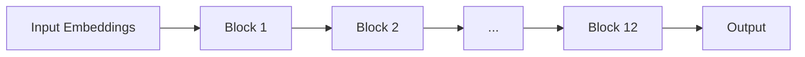

# Transformer Explainer -- 16 Sections

## Table of Contents

- [I. The Big Picture](#i-the-big-picture-what-is-happening) (Sections 1-3)
- [II. Turning Text into Numbers](#ii-turning-text-into-numbers-input-representation) (Sections 4-5)
- [III. The Core Engine](#iii-the-core-engine-transformer-blocks) (Sections 6-8)
- [IV. Stability & Regularization](#iv-stability--regularization-why-it-trains-properly) (Sections 9-10)
- [V. Producing the Next-Token Scores](#v-producing-the-next-token-scores-output-layer) (Sections 11-12)
- [VI. Sampling Strategy](#vi-sampling-strategy-decision-layer) (Sections 13-16)

---

## I. The Big Picture (What is happening?)

### 1. What is Transformer?

Transformer is the core architecture behind modern AI, powering models
like ChatGPT and Gemini. Introduced in 2017, it revolutionized how AI
processes information. The same architecture is used for training on
massive datasets and for inference to generate outputs. Here we use
GPT-2 (small), simpler than newer ones but perfect for learning the
fundamentals.

------------------------------------------------------------------------

### 2. How Transformers Work?

Transformers aren't magic---they build text step by step by asking:

**"What is the most probable next word that will follow this input?"**

**Example (from visualization):** Input text: `Mein Name ist Johannes` →
model predicts next token (e.g., `burg`).

------------------------------------------------------------------------

### 3. Transformer Architecture

Transformer has three main parts:

1.  **Embeddings** turn text into numbers.
2.  **Transformer blocks** mix information with Self-Attention and refine it
    with an MLP.
3.  **Probabilities** determine the likelihood of each next token.


------------------------------------------------------------------------

## II. Turning Text into Numbers (Input Representation)

### 4. Embedding

Before a Transformer can process text, it must convert it into numbers. This happens in two steps:

**Step 1: Tokenization** — The text is split into smaller units called **tokens**. These aren't always whole words; common subwords or characters get their own tokens.

**Step 2: Token → Vector** — Each token ID is used to look up a corresponding **embedding vector** from a learned embedding table.

**Example:** The sentence `Mein Name ist Johannes` becomes:

| Token | Token ID | Embedding (768 numbers) |
|-------|----------|-------------------------|
| `Me` | 5308 | [0.12, -0.45, 0.78, ..., -0.22] |
| `in` | 259 | [0.08, -0.41, 0.65, ..., -0.19] |
| `Name` | 6530 | [0.15, 0.23, -0.54, ..., 0.31] |
| `is` | 318 | [-0.05, 0.18, 0.42, ..., 0.09] |
| `t` | 83 | [0.22, -0.33, 0.11, ..., -0.45] |
| `Johannes` | 38579 | [0.07, -0.28, 0.89, ..., 0.14] |

Notice that "Mein" was split into `Me` + `in` and "ist" into `is` + `t`. The tokenizer breaks words into subwords based on what it learned during training.

**How does Token ID connect to the embedding vector?**

The Token ID is simply an **index into a lookup table**. GPT-2 has a vocabulary of 50,257 tokens. During training, it learns an **embedding table** — a matrix of size `50,257 × 768`. Each row is a unique vector for one token.

```
Embedding Table (learned during training):
┌─────────────────────────────────────────────┐
│ Row 0:     [0.02, -0.15, ..., 0.33]         │
│ Row 1:     [0.11,  0.08, ..., -0.21]        │
│ ...                                         │
│ Row 5308:  [0.12, -0.45, ..., -0.22]        │  ← "Me" looks up this row
│ ...                                         │
│ Row 50256: [...]                            │
└─────────────────────────────────────────────┘
```

That's it — a simple table lookup. The magic is that these 768 numbers per token were **learned during training** to capture useful meaning.

**What might these 768 dimensions represent?**

Each dimension can encode some aspect of a token's meaning. While the model learns these automatically and they're not always human-interpretable, you can imagine dimensions capturing things like:

| Dimension | Possible meaning | "King" | "Queen" | "Apple" |
|-----------|------------------|--------|---------|---------|
| dim 1 | Royalty | 0.9 | 0.85 | -0.1 |
| dim 2 | Gender (masc→fem) | -0.7 | 0.8 | 0.0 |
| dim 3 | Edible | -0.2 | -0.2 | 0.95 |
| dim 4 | Abstract concept | 0.3 | 0.3 | -0.8 |
| ... | ... | ... | ... | ... |

This is why vector math works on embeddings: `King - Man + Woman ≈ Queen` — the dimensions encoding gender shift while royalty stays intact.

------------------------------------------------------------------------

### 5. Positional Encoding

Word order matters in language. Consider:
- "Johannes ist Name" — doesn't make sense
- "Name ist Johannes" — grammatically correct

Without position information, the model would see the same set of tokens and wouldn't know which comes first. **Positional encoding** solves this by giving each token information about its place in the sequence.

**How it works:** GPT-2 has a second lookup table — a **positional embedding table** of size `1024 × 768` (max 1024 positions). Each position gets its own 768-number vector, which is **added** to the token embedding.

**Example:** For `Mein Name ist Johannes`:

| Position | Token | Token ID | Token Embedding | + | Position Embedding | = | Final Embedding |
|----------|-------|----------|-----------------|---|-------------------|---|-----------------|
| 0 | `Me` | 5308 | [0.12, -0.45, ...] | + | [0.01, 0.02, ...] | = | [0.13, -0.43, ...] |
| 1 | `in` | 259 | [0.08, -0.41, ...] | + | [0.03, -0.01, ...] | = | [0.11, -0.42, ...] |
| 2 | `Name` | 6530 | [0.15, 0.23, ...] | + | [0.02, 0.05, ...] | = | [0.17, 0.28, ...] |
| 3 | `is` | 318 | [-0.05, 0.18, ...] | + | [-0.01, 0.03, ...] | = | [-0.06, 0.21, ...] |
| 4 | `t` | 83 | [0.22, -0.33, ...] | + | [0.04, -0.02, ...] | = | [0.26, -0.35, ...] |
| 5 | `Johannes` | 38579 | [0.07, -0.28, ...] | + | [0.02, 0.01, ...] | = | [0.09, -0.27, ...] |

Now each token's embedding contains both **what** the token is and **where** it appears.

**What might positional dimensions represent?**

Like token embeddings, positional embeddings are learned during training. Each dimension might encode patterns about position:

| Dimension | Possible meaning | Pos 0 | Pos 1 | Pos 5 | Pos 1023 |
|-----------|------------------|-------|-------|-------|----------|
| dim 1 | Start of sequence | 0.95 | 0.6 | 0.1 | -0.3 |
| dim 2 | Even/odd position | 0.8 | -0.8 | -0.8 | -0.8 |
| dim 3 | Early vs late | 0.9 | 0.85 | 0.5 | -0.9 |
| dim 4 | Sentence boundary | 0.7 | 0.1 | 0.0 | 0.0 |
| ... | ... | ... | ... | ... | ... |

The model learns which positional patterns matter for language — like "the first word is often a subject" or "words near each other are likely related."

Newer models may use other methods like **RoPE** (Rotary Position Embedding), which encodes position by rotating vectors rather than adding to them.

------------------------------------------------------------------------

## III. The Core Engine (Transformer Blocks)

### 6. Transformer Blocks

A Transformer block is the main unit of processing in the model. It has two parts:

1. **Multi-head self-attention** — lets tokens share information with each other
2. **MLP** — refines each token's representation independently

Models stack many blocks so token representations become richer as they pass through. GPT-2 (small) has **12 blocks** stacked sequentially.



**Why stack blocks?** Each block refines the representation. Early blocks might learn basic patterns (grammar, word relationships), while later blocks capture more abstract concepts (sentiment, topic, intent).

------------------------------------------------------------------------

### 7. Multi-Head Self Attention

Self-attention lets each token "look at" all other tokens and decide which ones are relevant. This helps capture meaning and relationships, even between far-apart words.

**Example:** In `Mein Name ist Johannes`, when processing `Johannes`, the model might attend strongly to `Name` (because "Johannes" is the name being referenced).

In **multi-head** form, the model runs several attention processes in parallel (12 heads in GPT-2), each focusing on different patterns — one head might track grammar, another might track meaning, another might track coreference.

#### 7.1 Query, Key, Value

To perform self-attention, we need to transform each token's embedding into three vectors: **Query (Q)**, **Key (K)**, and **Value (V)**.

Let's trace this step by step for our sentence `Mein Name ist Johannes`.

**Step 1: Start with our input**

After embedding + positional encoding, we have 6 tokens, each with 768 dimensions:

```
Input shape: (6, 768)

Token 0 "Me":       [0.13, -0.43, 0.78, ..., -0.22]   (768 numbers)
Token 1 "in":       [0.11, -0.42, 0.65, ..., -0.19]   (768 numbers)
Token 2 "Name":     [0.17, 0.28, -0.54, ..., 0.31]    (768 numbers)
Token 3 "is":       [-0.06, 0.21, 0.42, ..., 0.09]    (768 numbers)
Token 4 "t":        [0.26, -0.35, 0.11, ..., -0.45]   (768 numbers)
Token 5 "Johannes": [0.09, -0.27, 0.89, ..., 0.14]    (768 numbers)
```

**Step 2: The QKV weight matrix**

The model has a learned weight matrix `W_qkv` that transforms embeddings into Q, K, and V.

**Where does it come from?**

This matrix is **learned during training**. Just like the embedding table, GPT-2 started with random numbers and adjusted them over billions of training examples until they produced useful Q, K, V vectors.

**What does it contain?**

`W_qkv` is a matrix of **1,769,472 numbers** (768 × 2304) that the model learned. Each number is a **weight** that controls how much one input dimension influences one output dimension.

**Concrete example with "Name" token:**

Remember from Section 4, the embedding for "Name" might encode things like:
- Dimension 42: "noun-ness" = 0.85 (high, because "Name" is a noun)
- Dimension 100: "verb-ness" = -0.2 (low, it's not a verb)
- Dimension 203: "refers to a person" = 0.6

Now, the Query vector needs to encode "what is this token looking for?" 

Let's say Q dimension 5 represents "looking for a name/identity". The weights determine how this is computed:

```
For token "Name" (Token ID 6530):

Embedding of "Name": [... , 0.85, ... , -0.2, ... , 0.6, ...]
                          dim 42    dim 100    dim 203

To compute Q[5] ("looking for a name"):

Q[5] = Embedding[0] × W[0,5] + Embedding[1] × W[1,5] + ... + Embedding[767] × W[767,5]

     = ... + 0.85 × 0.7  + ... + (-0.2) × 0.1 + ... + 0.6 × 0.8 + ...
             ────────────         ──────────         ──────────
             noun-ness            verb-ness          person-ref
             contributes          contributes        contributes
             strongly             a little           strongly

     = 0.92 (example result: "Name" strongly looks for identity-related tokens)
```

The model learned these weights so that:
- Nouns like "Name" produce Queries that search for related content
- The same "Name" token produces a Key that says "I contain a noun/label"
- And a Value that carries the actual meaning to pass along

```
W_qkv shape: (768, 2304)

         Output dimensions (2304)
         ┌─────────────────────────────────────────────────────┐
         │  Q part (768)  │  K part (768)  │  V part (768)    │
         │ "what I seek"  │ "what I am"    │ "what I offer"   │
         │ col 0...767    │ col 768...1535 │ col 1536...2303  │
    ┌────┼────────────────┼────────────────┼──────────────────┤
    │ 0  │  0.02  -0.01   │  0.03   0.05   │  -0.02   0.01    │
I   │ 1  │ -0.03   0.04   │  0.01  -0.02   │   0.04   0.03    │
n   │...│   ...   ...    │  ...    ...    │   ...    ...     │
p   │ 42│  0.70   0.30   │  0.80   0.10   │   0.50   0.40    │ ← "noun-ness" row
u   │...│   ...   ...    │  ...    ...    │   ...    ...     │
t   │767│  0.02  -0.03   │  0.02   0.01   │  -0.01   0.02    │
    └────┴────────────────┴────────────────┴──────────────────┘
(768)
```

**Why 2304 columns?**

```
2304 = 768 + 768 + 768
       ───   ───   ───
        Q     K     V

Each of Q, K, V needs 768 dimensions, so we produce all three at once.
```

**Full example for "Johannes" token:**

```
Embedding of "Johannes": [0.09, -0.27, 0.89, ..., 0.14]  (768 numbers)

After × W_qkv:

Q for "Johannes": [0.23, 0.45, -0.12, ..., 0.67]  → "I'm looking for: context about names"
K for "Johannes": [0.34, -0.18, 0.56, ..., 0.29] → "I am: a proper name, person reference"
V for "Johannes": [0.78, 0.12, -0.34, ..., 0.91] → "I carry: the identity 'Johannes'"
```

This is why later, when computing attention, "Johannes" (via its Q) will find "Name" (via its K) relevant — the model learned weights that make name-related tokens find each other.

**Step 3: Matrix multiplication**

Each token's embedding (768) is multiplied by W_qkv (768 × 2304):

```
For token "Me":
[0.13, -0.43, ..., -0.22] × W_qkv = [q1, q2, ..., q768, k1, k2, ..., k768, v1, v2, ..., v768]
       (768)              (768×2304)                        (2304)
```

**Step 4: Result for all tokens**

After multiplying all 6 tokens by the weight matrix:

```
Output shape: (6, 2304)

Token 0 "Me":       [q₀, q₁, ..., q₇₆₇, k₀, k₁, ..., k₇₆₇, v₀, v₁, ..., v₇₆₇]
Token 1 "in":       [q₀, q₁, ..., q₇₆₇, k₀, k₁, ..., k₇₆₇, v₀, v₁, ..., v₇₆₇]
Token 2 "Name":     [q₀, q₁, ..., q₇₆₇, k₀, k₁, ..., k₇₆₇, v₀, v₁, ..., v₇₆₇]
Token 3 "is":       [q₀, q₁, ..., q₇₆₇, k₀, k₁, ..., k₇₆₇, v₀, v₁, ..., v₇₆₇]
Token 4 "t":        [q₀, q₁, ..., q₇₆₇, k₀, k₁, ..., k₇₆₇, v₀, v₁, ..., v₇₆₇]
Token 5 "Johannes": [q₀, q₁, ..., q₇₆₇, k₀, k₁, ..., k₇₆₇, v₀, v₁, ..., v₇₆₇]
                    |____Q (768)____||____K (768)____||____V (768)____|
```

**Step 5: Split into Q, K, V**

We split the 2304 dimensions into three parts:

```
Q shape: (6, 768)  ← dimensions 0-767
K shape: (6, 768)  ← dimensions 768-1535  
V shape: (6, 768)  ← dimensions 1536-2303
```

**Step 6: Reshape for 12 heads**

Each 768-dimensional Q, K, V is split into 12 heads of 64 dimensions each:

```
Q reshaped: (6, 12, 64)  → 6 tokens, 12 heads, 64 dims per head
K reshaped: (6, 12, 64)
V reshaped: (6, 12, 64)
```

**The complete transformation:**

```
(6, 768)  →  × W_qkv  →  (6, 2304)  →  split  →  Q(6,768), K(6,768), V(6,768)  →  reshape  →  (6, 12, 64) each
 input       (768×2304)    QKV combined           separate Q, K, V                            per head
```

**What are Q, K, V used for?**

- **Query (Q):** "What am I looking for?" — used to search
- **Key (K):** "What do I contain?" — used to be searched
- **Value (V):** "What information do I provide?" — the actual content to retrieve

In the next step (7.3 Masked Self Attention), each token's Query will be compared against all Keys to compute attention scores, which determine how much of each Value to use.

#### 7.2 Why Multiple Heads?

Each head works with smaller vectors (64 dimensions instead of 768). GPT-2 has **12 heads**, and `12 × 64 = 768`.

Why multiple heads? Each head can specialize in different patterns:

| Head | Might learn to track |
|------|---------------------|
| Head 1 | Subject-verb relationships |
| Head 2 | Adjective-noun pairs |
| Head 3 | Long-range references |
| Head 4 | Punctuation patterns |
| ... | ... |

This lets the model capture many types of relationships simultaneously.

#### 7.3 Masked Self Attention

In each head, attention scores determine how much each token focuses on others:

1. **Dot Product** — Multiply Query with each Key to get raw attention scores
2. **Mask** — Hide future tokens (set scores to -∞) so the model can't "peek ahead"
3. **Softmax** — Convert scores to probabilities (each row sums to 1)

**Example:** For `Mein Name ist Johannes`, the attention matrix might look like:

|  | Me | in | Name | is | t | Johannes |
|--|----|----|------|----|---|----------|
| **Me** | 0.8 | 0.2 | - | - | - | - |
| **in** | 0.3 | 0.7 | - | - | - | - |
| **Name** | 0.1 | 0.2 | 0.7 | - | - | - |
| **is** | 0.1 | 0.1 | 0.3 | 0.5 | - | - |
| **t** | 0.1 | 0.1 | 0.2 | 0.4 | 0.2 | - |
| **Johannes** | 0.1 | 0.1 | 0.5 | 0.1 | 0.1 | 0.1 |

The `-` entries are masked (future tokens). Notice `Johannes` attends strongly to `Name` (0.5).

#### 7.4 Attention Output & Concatenation

Each head multiplies its attention scores with the Value embeddings to produce an **attention output** — a refined representation of each token after considering context.

GPT-2's 12 heads each produce a 64-dimensional output. These are **concatenated** back to 768 dimensions:

```
[Head 1 output (64)] + [Head 2 output (64)] + ... + [Head 12 output (64)] = [768]
```

------------------------------------------------------------------------

### 8. MLP (Multi-Layer Perceptron)

After attention, each token's embedding goes through an MLP independently. This is a simple feed-forward network:

```
Input (768) → Linear → GELU activation → Linear → Output (768)
           ↓         ↓                  ↓
         (768→3072)  (non-linearity)   (3072→768)
```

The MLP expands to 3072 dimensions (4× larger), applies a non-linear activation (GELU), then projects back to 768. This allows the model to learn complex transformations of each token's representation.

**Why expand then shrink?** The larger intermediate layer gives the network more "room" to compute complex functions before compressing back down.

------------------------------------------------------------------------

## IV. Stability & Regularization (Why it trains properly)

**Goal:** Understand architectural helpers that ensure stable training.

**These aren't part of the core "math of attention," but they are critical for:**
- Training stability
- Generalization
- Preventing exploding activations

### 9. Layer Normalization

Layer Normalization helps stabilize both training and inference by
adjusting input numbers so their mean and variance stay consistent. This
makes the model less sensitive to its starting weights and helps it
learn more effectively. In GPT-2, it's applied before self-attention,
before the MLP, and once more before the final output.

**Example (from visualization):** LayerNorm applied before attention and
before MLP inside each block.

------------------------------------------------------------------------

### 10. Dropout

During training, dropout randomly turns off some connections between
numbers so the model doesn't overfit to specific patterns. This helps it
learn features that generalize better. GPT-2 uses it, but newer LLMs
often skip it because they train on huge datasets and overfitting is
less of a problem. In inference, dropout is turned off.

**Example (from visualization):** Dropout shown inside block during
training; disabled during inference.

------------------------------------------------------------------------

## V. Producing the Next-Token Scores (Output Layer)

**Goal:** Convert final token representation into probability distribution.

**This phase converts:**
```
Final token embedding → 50,257 logits → probability distribution
```

**Now the model knows how likely each token is.**

### 11. Output Logit

After all Transformer blocks, the last token's output embedding,
enriched with context from all previous tokens, is multiplied by learned
weights in a final layer.

This produces logits, 50,257 numbers---one for each token in GPT-2's
vocabulary---that indicate how likely each token is to come next.

**Example (from visualization):** Logits include values like -77.82,
-78.36, -78.38, etc.

------------------------------------------------------------------------

### 12. Probabilities

Logits are just raw scores. To make them easier to interpret, we convert
them into probabilities between 0 and 1, where all add up to 1. This
tells us the likelihood of each token being the next word.

Instead of always picking the highest-probability token, we can use
different selection strategies to balance safety and creativity in the
generated text.

**Example (from visualization):** `burg` → 37.70%\
`von` → 19.28%\
`de` → 18.80%

------------------------------------------------------------------------

## VI. Sampling Strategy (Decision Layer)

**Goal:** Determine how tokens are selected from probability distribution.

**This is not part of the model itself — it's a decoding strategy layered on top.**

**This determines:**
- Deterministic vs creative
- Conservative vs diverse outputs

### 13. Temperature

Temperature works by scaling the logits before turning them into
probabilities. A low temperature (e.g., 0.2) makes large logits even
larger and small ones smaller, favoring the highest-scoring tokens and
leading to more predictable choices. A high temperature (e.g., 1.0 or
above) flattens the differences, making less likely tokens more
competitive and leading to more creative outputs.

**Example (from visualization):** logit -77.82 ÷ 0.8 → scaled logit
-97.28 before softmax.

------------------------------------------------------------------------

### 14. Top-K Sampling

Top-K sampling filters the probability distribution by only keeping the
K most likely tokens. This prevents the model from sampling very unlikely
tokens that would produce nonsensical output. It works by setting all
probabilities outside the top-K to zero, then renormalizing so they sum
to 1 again.

**Example (from visualization):** If K = 10, only the 10 highest-probability
tokens are candidates; others are excluded.

------------------------------------------------------------------------

### 15. Top-P (Nucleus) Sampling

Top-P sampling uses a different strategy: it keeps the smallest set of
tokens whose cumulative probability exceeds threshold P (commonly 0.9).
This adapts to the shape of the probability distribution---when confidence
is high, fewer tokens are selected; when uncertain, more tokens are included.

**Example (from visualization):** Select tokens until cumulative probability
reaches 90%, regardless of how many that includes.

------------------------------------------------------------------------

### 16. Combining Strategies

In practice, temperature, top-K, and top-P are often used together to
balance diversity and coherence. Temperature reshapes the distribution,
while top-K and top-P act as safety filters that prevent sampling from
the tail of unlikely tokens.

**Example (from visualization):** Apply temperature scaling first, then
filter with top-K and/or top-P to finalize token selection.

------------------------------------------------------------------------

## Summary: The Complete Pipeline

1. **Input Representation:** Text → Tokens → Embeddings + Positional Encoding
2. **Context Processing:** 12 stacked Transformer blocks, each with Self-Attention + MLP
3. **Stabilization:** LayerNorm and Dropout ensure stable learning
4. **Scoring:** Output layer produces logits; softmax converts to probabilities
5. **Decoding:** Temperature, top-K, top-P guide final token selection

---

## Mental Model: 5 Essential Layers

If teaching executives or engineers, compress to:

1. **Objective:** Predict next token.
2. **Representation:** Embedding + Positional Encoding.
3. **Context Engine:** Repeated blocks:
   - Self-attention
   - MLP
   - Residuals
   - LayerNorm
4. **Scoring:** Linear layer → logits → softmax.
5. **Selection:** Temperature / top-k / top-p sampling.
